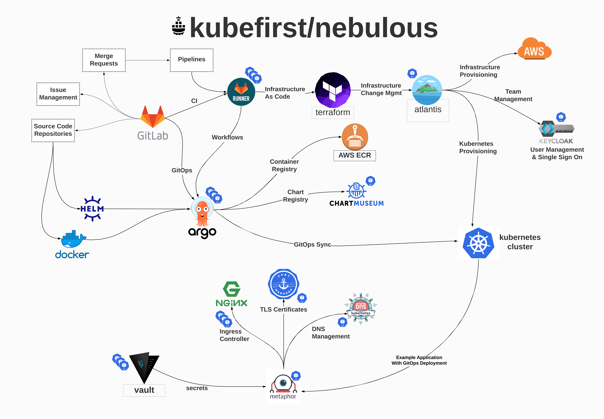

# nebulous
The Kubefirst Open Source Platform Generator



# tl;dr:
- step 1: establish a new aws account with a single hosted zone that's receiving traffic from your domain name registrar
- step 2: add your 6 configuration values to kubefirst.env and run the nebulous container
- step 3: get a fully-functioning application delivery ecosystem, complete with kubernetes, gitops, vault, terraform, atlantis, gitlab, gitlab-runner, keycloak, and a sample app that demonstrates how it all works.

# docs
- [introduction](https://docs.kubefirst.com/)
- [installation](https://docs.kubefirst.com/nebulous/install/)
- [getting familiar](https://docs.kubefirst.com/kubefirst/getting-started/)
- [teardown](https://docs.kubefirst.com/nebulous/teardown/)
- [faq](https://docs.kubefirst.com/nebulous/faq/)
- [contact](https://docs.kubefirst.com/contact/)

---

# contributor guide

The docs above are tailored to our end user's experience. However things are a little different if you're contributing to nebulous itself. The docs that follow are intended only for source contributors.

### step 1 - setup nebulous.env

For a first run, this step is no different than the guidance to our end users, you need to set up a `kubefirst.env` in the nebulous repo's root directory. You can create the file template by running this from your terminal, editing with your values with the normal settings.

For subsequent executions, especially while debugging, it's sometimes helpful to use some additional environment variables that allow you to control the flow of execution. See the notes in each section for details on controlling your debugging.

In addition to the flow controls, you'll also find some hack comments by the various terraform apply commands. This allows you to change apply commands to exiting deploy commands. This can also be valuable when you need a mulligan on a particular section.

```bash
cat << EOF > kubefirst.env
###############################
# Note: Operational Flow Controls - uncomment the items below 
# when you want to skip over various sections. Leaving them
# all commented like they are here will execute everything.
# 
#
# SKIP_HZ_CHECK=true
# SKIP_DETOKENIZATION=true
# SKIP_BASE_APPLY=true
# SKIP_GITLAB_RECONFIG=true
# SKIP_GITLAB_APPLY=true
# SKIP_VAULT_APPLY=true
# SKIP_KEYCLOAK_APPLY=true


###############################
# Note: Bucket Reuse - when you successfully get past base terraform
# apply, take the random suffix that was generated, apply it to the 
# next line, and start reusing the bucket for subsequent iterations.
# if you don't set this value on subsequent runs, it will keep 
# generating new buckets for you. You can find this value in the 
# nebulous execution output. (be sure to uncomment when setting)
# 
# BUCKET_RAND=abc123

###############################
# AWS Account Information
AWS_ACCESS_KEY_ID=YOUR_ADMIN_AWS_ACCESS_KEY_ID
AWS_SECRET_ACCESS_KEY=YOUR_ADMIN_AWS_SECRET_ACCESS_KEY
AWS_HOSTED_ZONE_NAME=yourdomain.com
AWS_DEFAULT_REGION=YOUR_AWS_REGION

###############################
# Logistics
EMAIL_ADDRESS=EMAIL_ADDRESS=YOUR_EMAIL_ADDRESS

###############################
# Gitlab
GITLAB_BOT_ROOT_PASSWORD=$omePasswordOnlyYouKn0w!

EOF
```

### step 2 - build nebulous locally

Come up with local tag name for your nebulous image. We'll use `foo` as our example local tag name in these docs. To build the `foo` tag of nebulous run the following from your local nebulous repo root directory.

```bash
docker build . -t nebulous:foo
```

### step 3 - running nebulous

Once you have built the `nebulous:foo` image as shown above, you can kickoff the automated init script by running the following. The difference between this guidance and the end user guidance is that this mounts the `gitops`, `scripts`, and `git` directories to your localhost volume so you can negotiate changes to the runtime environment on the fly.

This is how you run the container with the volume mounts. Run this from your nebulous directory:
```
docker run -it --env-file=kubefirst.env -v $PWD/gitops:/gitops -v $PWD/metaphor:/metaphor -v $PWD/scripts:/scripts -v $PWD/git:/git --entrypoint /scripts/nebulous/init.sh nebulous:foo
```

If you find yourself iterating a lot, a `k1` alias is convenient, this one is for an image tagged `nebulous:foo`, adjust the last word accordingly.
```
k1() {
  echo "don't forget to breathe"
  docker run -it --env-file=kubefirst.env -v $PWD/gitops:/gitops  -v $PWD/metaphor:/metaphor -v $PWD/scripts:/scripts -v $PWD/git:/git --entrypoint /scripts/nebulous/init.sh nebulous:foo  
}
```

### step 4 - teardown (once you're ready to tear it all back down, obviously)

There are a few things to note about teardown.

Nebulous creates a VPC, some subnets, a gitlab server, a kubernetes cluster, some policies, roles, and a few other things (complete list in the teardown docs). Terraform knows about all of these things, and if you only created these resources, you'll be able to run teardown without thinking too hard.

However, terraform is only able to destroy resources that are managed in terraform. It doesn't know about things you do manually. Anything you may have added through non-terraform operations must be manually removed before running the teardown script. 

Let's consider, for example, a scenario where you manually `helm install`ed an app to your new cluster, and that app spins up a new load balancer in your VPC. If you don't remove that app and its load balancer before running destroy, you won't be able to complete the terraform destroy operation. This is because you can't remove a VPC that still has a live load balancer running in it.

With that context in mind, once you've removed the manual things you may have added to this environment, you can kickoff the automated destroy script by running:
```
docker run -it --env-file=kubefirst.env -v $PWD/gitops:/gitops -v $PWD/metaphor:/metaphor -v $PWD/scripts:/scripts -v $PWD/git:/git --entrypoint /scripts/nebulous/destroy.sh  nebulous:foo  
```
