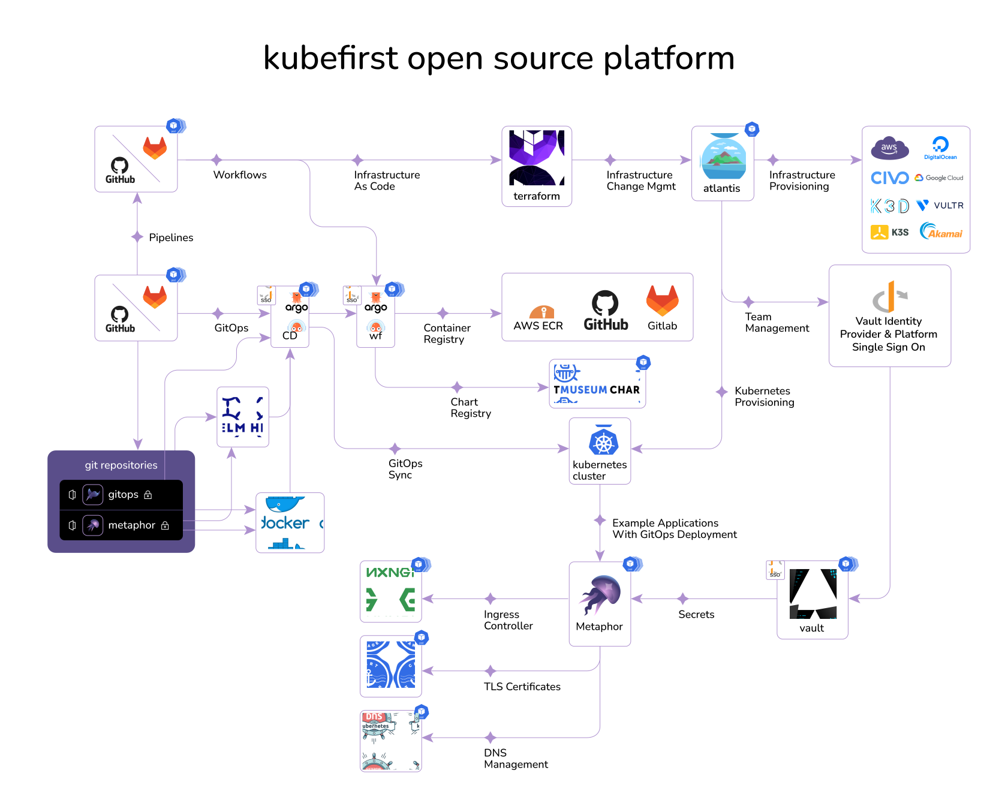

<!-- markdownlint-disable MD041 -->

  <picture>
    <source media="(prefers-color-scheme: dark)" srcset="images/kubefirst-light.svg" alt="Kubefirst Logo">
    
  </picture>

  Cluster Management Platform with Application Delivery

  <a href="https://kubefirst-pro.konstruct.io/docs/">Install</a>&nbsp;|&nbsp;
  <a href="https://twitter.com/konstructio">Twitter</a>&nbsp;|&nbsp;
  <a href="https://www.linkedin.com/company/konstruct">LinkedIn</a>&nbsp;|&nbsp;
  <a href="https://k1.social/slack">Slack</a>&nbsp;|&nbsp;
  <a href="https://blog.konstruct.io">Blog</a>

  
  <!--  -->
  

---

# Kubefirst CLI

The Kubefirst CLI creates instant GitOps platforms that integrate some of the best tools in cloud native from scratch in minutes.

Each of our platforms have install guides that detail the prerequesites, commands, and resulting platform that you'll receive.

- [Akamai](https://kubefirst-pro.konstruct.io/docs/install/akamai/)
- [AWS](https://kubefirst-pro.konstruct.io/docs/install/aws/)
- [Azure](https://kubefirst-pro.konstruct.io/docs/install/azure/cli/)
- [Civo](https://kubefirst-pro.konstruct.io/docs/install/civo/)
- [DigitalOcean](https://kubefirst-pro.konstruct.io/docs/install/digoc/)
- [Google Cloud](https://kubefirst-pro.konstruct.io/docs/install/google/)
- [Vultr](https://kubefirst-pro.konstruct.io/docs/install/vultr/)
- [K3s](https://kubefirst-pro.konstruct.io/docs/install/k3s/)
- [k3d (local)](https://kubefirst-pro.konstruct.io/docs/install/k3d/)

## Overview

<https://kubefirst-pro.konstruct.io/docs/>

## Kubefirst Pro

Our commercial [Kubefirst Pro](https://kubefirst-pro.konstruct.io/docs/) platform management UI will be installed to your new OSS platform by default for the best experience.

## Feed K-Ray

Feed K-Ray a GitHub star ⭐ above to bookmark our project and keep K-Ray well fed!!

