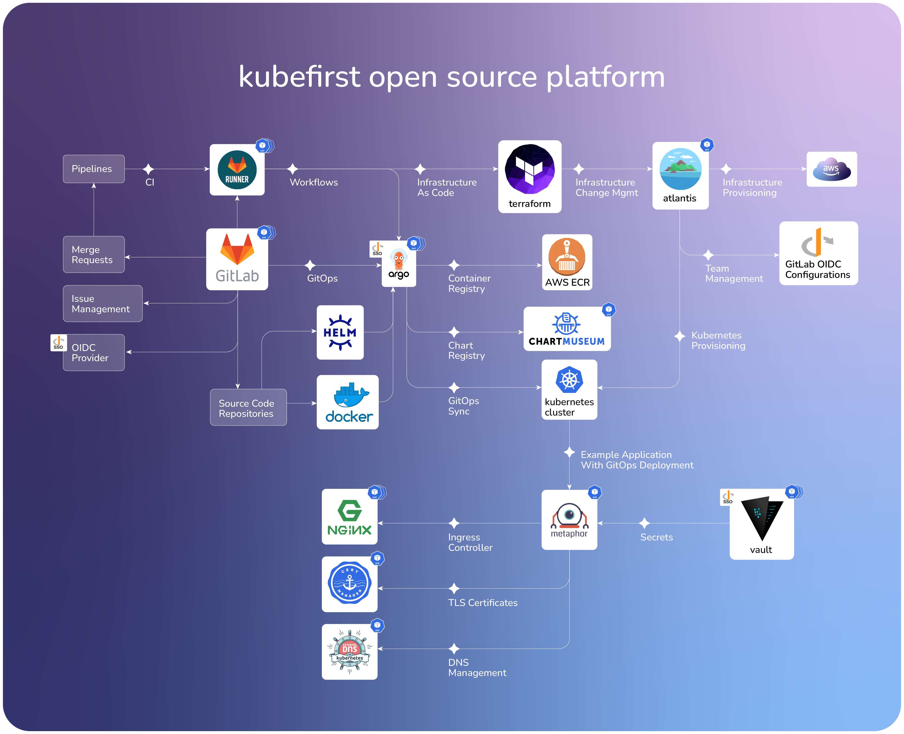

<!-- markdownlint-disable MD041 -->

  <picture>
    <source media="(prefers-color-scheme: dark)" srcset="images/kubefirst-light.svg" alt="Kubefirst Logo">
    
  </picture>

  GitOps Infrastructure & Application Delivery Platform

  <a href="https://docs.kubefirst.io/">Install</a>&nbsp;|&nbsp;
  <a href="https://twitter.com/kubefirst">Twitter</a>&nbsp;|&nbsp;
  <a href="https://www.linkedin.com/company/kubefirst">LinkedIn</a>&nbsp;|&nbsp;
  <a href="https://join.slack.com/t/kubefirst/shared_invite/zt-r0r9cfts-OVnH0ooELDLm9n9p2aU7fw">Slack</a>&nbsp;|&nbsp;
  <a href="https://kubeshop.io/blog-projects/kubefirst">Blog</a>

  
  <!--  -->
  

---

# Kubefirst CLI

The Kubefirst CLI creates instant GitOps platforms that integrate some of the best tools in cloud native from scratch in minutes.

Each of our platforms have install guides that detail the prerequesites, commands, and resulting platform that you'll receive.

- [k3d (local)](https://docs.kubefirst.io/k3d/overview/)
- [AWS](https://docs.kubefirst.io/aws/overview/)
- [Civo](https://docs.kubefirst.io/civo/overview/)
- [DigitalOcean](https://docs.kubefirst.io/do/overview/)

In beta:

- [Akamai](https://docs.kubefirst.io/akamai/overview)
- [Google Cloud](https://docs.kubefirst.io/gcp/overview/)
- [K3s](https://docs.kubefirst.io/k3s/overview)
- [Vultr](https://docs.kubefirst.io/vultr/overview/)

## Overview

<https://docs.kubefirst.io>

## Feed K-Ray

Feed K-Ray a GitHub star ⭐ above to bookmark our project and keep K-Ray happy!!

## Contributions

We want to thank all of our contributors who created a pull request to fix a bug, add a new feature or update the [documentation](https://github.com/kubefirst/docs/). We also value a lot contributions in the form of bug reporting or feature requests: it helps us continuously make kubefirst better. Lastly, helping the users in our Slack community, or helping us share the love on social media are also ways in which you support us tremendously. We know your time is valuable, and we can't thank you enough for everything you do: we wouldn't be where we are without you!

A special thanks to [DrummyFloyd](https://github.com/DrummyFloyd) who, in addition to adding support for k3s, is a champion all around within our community and the kubefirst project 🫶

If you want to help in any capacity, check [CONTRIBUTING.md](CONTRIBUTING.md).
