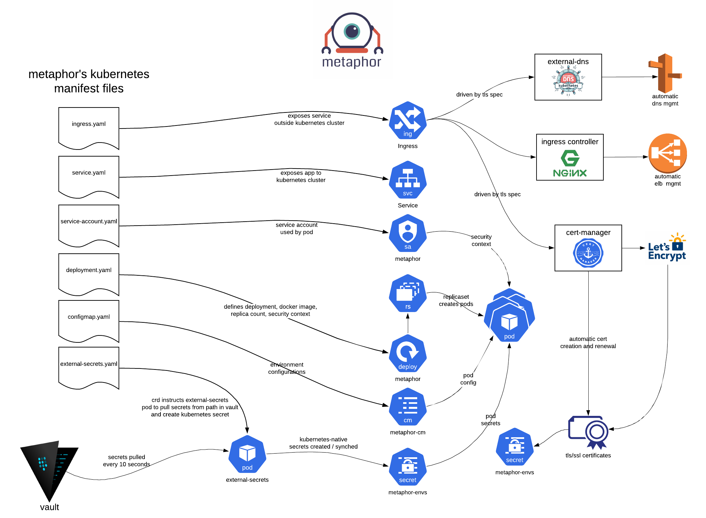

# Metaphor

A **Metaphor** is a suite of demo microservice applications to demonstrate how an application can be integrated into the 
Kubefirst platform following best practices. The demo applications consists of a **Metaphor frontend**, 
**Metaphor Go API**, and **Metaphor NodeJS API**.

## Best Practices

The **Metaphor** applications provide a demonstration space for application best practices in a tangible way that's 
easy to apply to other projects. When engineers discover good patterns to use in other 
projects, they can add that new idea in the most straightforward way possible to the Metaphor applications as well. By doing so 
our engineering team can fully engage with the best application approaches.

## CI/CD

The **Metaphor** applications come with complete CI/CD processes including automated builds, container Helm chart creation, container 
and Helm chart publishing, linting, tests, GitOps deployments to `development`, `staging`, and `production` namespaces, 
release management, version management, and hotfixes. It serves as an excellent proving ground for changes to the CI/CD layer.

When a new version of our CI is needed, it's best to adopt that new version of the CI in a **Metaphor** application
first. Run through the adjustments to your automation and test it through all of your environments and kubernetes 
clusters without impacting the applications that your engineers and users depend on.

## Kubernetes Representations

The **Metaphors** applications are multi-instance load balanced applications. It's deployed to the `development`, 
`staging`, and `production` namespaces in your `kubefirst` cluster.



The Kubernetes manifests produced by the **Metaphors** applications CI include a working example of a Kubernetes 
deployment with downstream ReplicaSet and pods, a service account with a security context used, a service to make the 
application available to the cluster, and an Ingress to make the service available outside the cluster.

## Ingress Integrations

The Ingress manifest demonstrates integration with our automated approach to DNS management, load balancer management, 
and TLS/SSL certificate creation and renewal.

``` yaml
apiVersion: extensions/v1beta1
kind: Ingress
metadata:
  annotations:
    kubernetes.io/ingress.class: nginx
    # Change the next line to "letsencrypt-staging" while testing adjustments, change to "letsencrypt-prod" after confirming LE certificate was issued
    cert-manager.io/cluster-issuer: "letsencrypt-prod"
  name: metaphor
  labels:
    run: metaphor
spec:
  rules:
    - host: metaphor-development.your-company.io
      http:
        paths:
          - backend:
              serviceName: metaphor
              servicePort: 3000
            path: /
  tls:
    - secretName: metaphor-tls
      hosts:
        - metaphor-development.your-company.io
```

## Some Cool Automated Things to Note:

- The value specified in `spec.rules.host` will automatically create a route53 CNAME that is bound to the Ingress elastic load balancer.
- The `cert-manager.io/cluster-issuer` annotation will prompt `cert-manager` to automatically create a certificate for your application and will store that cert in the `secretName` specified.
- NGINX will automatically route traffic to the **Metaphors** applications service based on the path-based/host-based routing specified in `spec.rules`.

### Environment Configs and Secrets

The **Metaphors** applications also includes a working example of how to leverage a multi-environment secrets management 
paradigm powered by **Vault** and `external-secrets`.

There's also a configmap implementation to demonstrate how to leverage non-sensitive configuration values.

### Datadog Integrations

The **Metaphors** applications are set up to provide cloud and container observability and monitoring best practices 
with **Datadog**. It demonstrates using **Datadog** for **Metaphors** application logs, container statistics, application 
metrics, application performance monitoring, dashboard, and alerting.

### Secrets Management

The **Metaphors** applications leverages hashicorp **Vault** for secrets management. **Vault** runs in the `mgmt` cluster 
and metaphor runs in `preprod` and `production`, so it serves as an example for secrets management. To read more see our 

[//]: # (todo: fix link)
[Vault page](../kubefirst/gitlab/vault.md)
