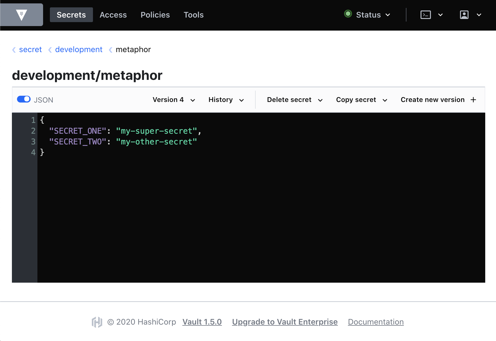
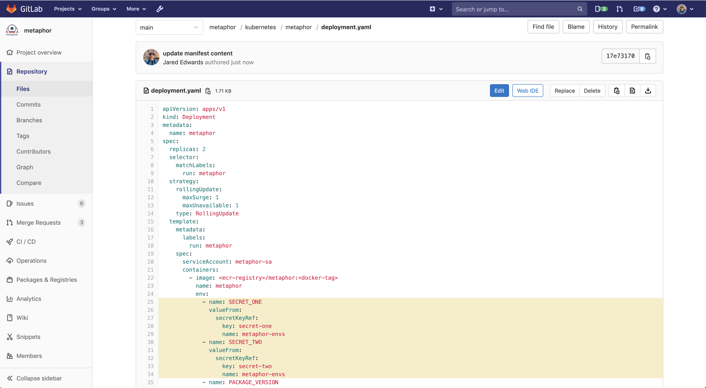

# Vault

[Vault](https://www.vaultproject.io/) is our secrets manager. It runs in Kubernetes with a 
[DynamoDB](https://aws.amazon.com/dynamodb/) backend that's encrypted with kms.

### After Install


`todo: metaphor secrets and external-secrets-operator need current details`

## Authentication

Your infrastructure will be set up with Vault running in the eks cluster. The `external-secrets` app is preconfigured 
to be able to pull secrets from your cluster's vault instance.

There are numerous other authentication schemes available to you as well:
[https://www.vaultproject.io/docs/auth](https://www.vaultproject.io/docs/auth)

## Secrets Setup for Applications

There's an [external-secrets](https://github.com/external-secrets/kubernetes-external-secrets) pod running in each of 
our clusters. `external-secrets` is able to keep kubernetes secrets in sync with the values in vault so your kubernetes 
apps can use them.

Let's explore how this works in our demo application Metaphor Go. 

### Storing secrets in Vault

First, let's look in your [vault kv store](https://vault.mgmt.kubefirst.com/ui/vault/secrets/secret/show/development/metaphor).



Here you can see we have two secrets stored at `secret/development/metaphor` named `SECRET_ONE` and `SECRET_TWO`.

### Creating Kubernetes Secrets From Vault Secrets

Now let's visit metaphor [external secrets definition] `/kubernetes/metaphor/external-secrets.yaml`. We can see 
here that we've defined an external-secrets manifest which will collect secrets from the vault path 
`secret/data/development/metaphor` (be mindful of the `/data/` that Vault imposes on your paths). It will take the 
values from those paths and produce a secret named metaphor-envs with a `secret-one` and `secret-two` derived from 
vault's `SECRET_ONE` and `SECRET_TWO` property.

> note: the below `<values>` are token values replaced via helm templating
```
apiVersion: "kubernetes-client.io/v1"
kind: ExternalSecret
metadata:
  name: metaphor-envs
spec:
  backendType: vault
  vaultMountPoint: kubernetes/<vault-mount-point>
  vaultRole: external-secrets
  kvVersion: 2
  data:
    - name: secret-one
      key: secret/data/<namespace>/metaphor
      property: SECRET_ONE
    - name: secret-two
      key: secret/data/<namespace>/metaphor
      property: SECRET_TWO
```

### Confirming Your Kubernetes Secrets

Applying the above ExternalSecret resource to your kubernetes namespace is enough to produce a kubernetes secret which 
will stay in sync with Vault's values. Let's confirm:

#### 1. get all secrets in the development namespace:

```
(⎈ |k8s-preprod:development) % kubectl -n development get secrets
NAME                      TYPE                                  DATA   AGE
default-token-7glxr       kubernetes.io/service-account-token   3      26d
docs-tls                  kubernetes.io/tls                     2      7d11h
metaphor-envs             Opaque                                2      21d
metaphor-sa-token-w4lht   kubernetes.io/service-account-token   3      26d
metaphor-tls              kubernetes.io/tls                     2      26d
```

#### 2. get the yaml of the one named `metaphor-envs`:

```
(⎈ |k8s-preprod:development) % kubectl -n development get secret metaphor-envs -oyaml
apiVersion: v1
data:
  secret-one: bXktc3VwZXItc2VjcmV0
  secret-two: bXktb3RoZXItc2VjcmV0
kind: Secret
metadata:
  creationTimestamp: "2020-11-18T05:22:15Z"
  name: metaphor-envs
  namespace: development
  ownerReferences:
  - apiVersion: kubernetes-client.io/v1
    controller: true
    kind: ExternalSecret
    name: metaphor-envs
    uid: 63c88d17-4623-40e9-8457-921a5aeb32c8
  resourceVersion: "4491034"
  selfLink: /api/v1/namespaces/development/secrets/metaphor-envs
  uid: 129cc5a2-d134-4ca1-be7b-f5c26cec0fbd
type: Opaque
```

### 3. confirm that it's your value from vault:

```
(⎈ |k8s-preprod:development) % echo "bXktc3VwZXItc2VjcmV0" | base64 -d
my-super-secret%                                   
```

#### Using Those Secrets in Your App

Now that you have native kubernetes secrets available, you can just use them however you choose. Our metaphor example 
uses them as environment variables as shown here



> Note: there are a ton of other ways secrets can be leveraged in your app, like 
[using secrets as files on pods](https://kubernetes.io/docs/concepts/configuration/secret/), or 
[storing your dockerhub login](https://kubernetes.io/docs/concepts/configuration/secret/#docker-config-secrets)

The [Metaphor](../common/metaphors.md) app will show you these secrets when you visit 
[metaphor](https://metaphor-development.preprod.kubefirst.com/). Now obviously you don't want to actually show your 
secrets in a web response, but it helps us demonstrate since these metaphor secrets don't need protection.
