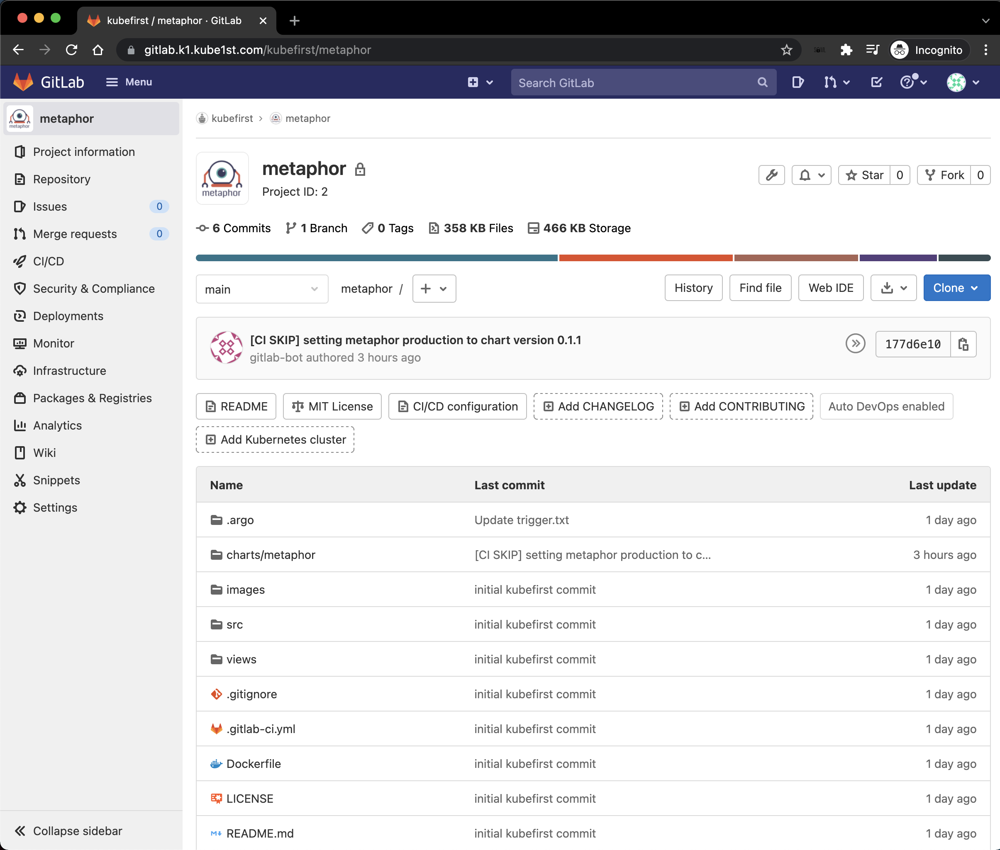
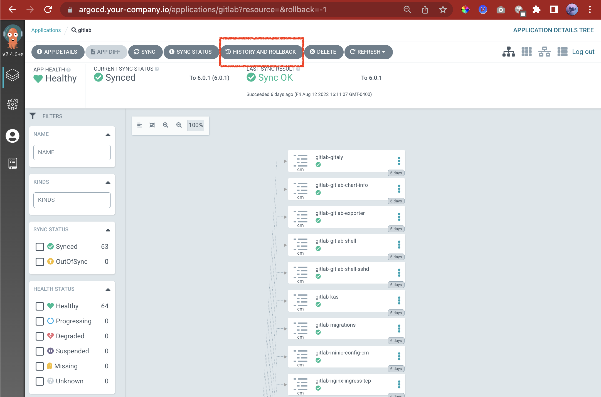
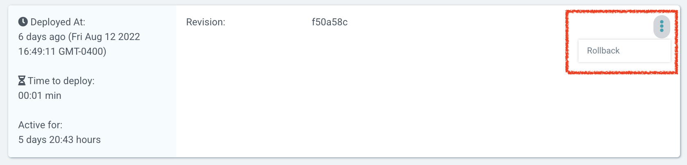

# GitLab



## Self Hosted GitLab Server

Our GitLab server runs in kubernetes in the `gitlab` namespace. It's registered in your `gitops` repository at [registry/gitlab.yaml](https://github.com/kubefirst/gitops-template/blob/main/registry/gitlab.yaml)

The GitLab chart has [great docs](https://docs.gitlab.com/charts/installation/index.html) and administrators should familiarize themselves with their best practices.

### GitLab Upgrade Process

Consult with GitLab's [guidance](https://docs.gitlab.com/omnibus/update/README.html) for details about preparing for their releases. 

GitLab recommends that you backup your instance before any upgrade. See their [backup/restore docs](https://docs.gitlab.com/charts/backup-restore/index.html) for details.

Consider subscribing to GitLab's [release blog](https://about.gitlab.com/releases/categories/releases/) as well to stay up to date with their monthly releases.

### GitLab (non-gitops) Rollback Process

Unlike all other applications on the kubefirst platform

If you ever run into an issue on a GitLab upgrade or gitops operation that changes GitLab configuration, there's some risk that GitLab will be negatively impacted by the change and become unavailable. Should this occur, you may find that you're in a bit of a GitOps catch-22. Typically in this scenario, you would simply revert the merge request that broke the application, and GitOps (i.e. ArgoCD) would take care of the rollback (by rolling the git revert forward).

However since GitLab **is the Git source of truth** for your GitOps, you cannot roll back GitLab by reverting the commit because Git itself may be inaccessible to Argo CD. To remedy this, conduct a rollback to a prior state, go to the `gitlab` application in Argo CD and click the `History and Rollback` button in the header.



This will bring up a window with all versions of GitLab. Presumably, you'll want to restore to the 2nd version in this list, which would represent GitLab's state just prior to the last change that was made through GitOps. Assuming that's the version you want to restore to, click the vertical elipsis and select Rollback.



This will warn you that you're disabling auto-sync, click confirm.
```
Auto-Sync needs to be disabled in order for rollback to occur. Are you sure you want to disable auto-sync and rollback application 'gitlab'?
```

Click OK to proceed with the rollback. With GitLab now restored to it's operational state, you can revert the breaking GitLab change in the GitOps repo, reenable auto-sync in argocd, and try the operation again in light of the failure you've discovered.

This process is only for GitLab, since it's the git source of truth for your GitOps. See 