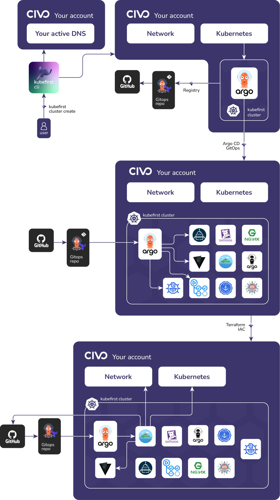

# Civo Platform Installation

`kubefirst` is our command line tool that installs the Kubefirst platform to your local or cloud environment. It installs a fully automated platform of open source cloud native tools to your Civo cloud with a simple `kubefirst civo create` command.



### Local Prerequisites

- [kubefirst CLI](../../kubefirst/overview.md#how-to-install-kubefirst-cli)

### GitHub Prerequesites

- [A github org](https://docs.github.com/en/organizations/collaborating-with-groups-in-organizations/creating-a-new-organization-from-scratch)
- [A new github account for your `kbot` automation user](https://docs.github.com/en/get-started/signing-up-for-github/signing-up-for-a-new-github-account)
- [A github Personal Access Token for your `kbot` account](../../explore/github-token.md)

### Civo Prerequisites

For your Civo cloud resources to provision we have a couple prerequisites:    

- [A Civo account in which you are an account owner](https://dashboard.civo.com/signup)
- [A publicly routable dns](https://www.civo.com/learn/configure-dns#adding-a-domain-name)


## Create your new kubefirst cluster

Adjust the following commands to include your new GitHub Personal Access Token from the GitHub Prerequisites step above, your civo token from your [Civo Security Settings](https://dashboard.civo.com/security), and the appropriate values for your new platform.

```shell
# change each of these lines to your values
export GITHUB_TOKEN=ghp_xxxxxxxxxxxxxxxx
export CIVO_TOKEN=xxxxxxxxxxxxxxxxxxxxxxxxxxxxxxxxxxxx
kubefirst civo create --admin-email you@your-company.io --github-owner your-github-org --domain-name your-domain.io --cluster-name kubefirst
```

The `kubefirst` cli will produce a directory of utilities, a state file, and some staged platform content that can now be found at `~/.kubefirst` and `~/.k1`.

If your run is not successful, errors and troubleshooting information will be stored in a local log file specified during the installation run.

The installation process may take about 10 minutes. If you are successful you should see:

```shell
Cluster "kubefirst" is up and running!
```

#### Installed Applications

Kubefirst implicitly contains many applications to provide starting capabilities for new users. Operational knowledge of all applications is not necessary to begin using Kubefirst, but is useful to understand your cluster.

A newly created Civo Kubefirst cluster contains:

- A private repo named `gitops`. The applications that you build and release on the kubefirst platform will also be registered here in the development, staging, and production folders. 
- [Argo CD](https://github.com/argoproj/argo-cd) - GitOps Continuous Delivery
- [Argo Workflows](https://argoproj.github.io/argo-workflows/) - Application Continuous Integration
- [Atlantis](https://www.runatlantis.io/) - Terraform Workflow Automation
- [Cert Manager](https://cert-manager.io/) - Automated TLS Certificate Creation and Renewal
- [Chart Museum](https://github.com/helm/chartmuseum) - Helm Chart Registry
- [External DNS](https://github.com/kubernetes-sigs/external-dns) - Automated DNS Management
- [External Secrets Operator](https://external-secrets.io/) - Syncs Kubernetes secrets with Vault secrets
- [GitHub Action Runner](https://github.com/features/actions) - Self Hosted GitHub Action Runner
- [Metaphor](https://github.com/kubefirst/metaphor-frontend-template) - A sample app to demonstrate CI/CD in on Kubernetes. Contains Devlopment, Staging, and Production environments.
- [Nginx Ingress Controller](https://github.com/kubernetes/ingress-nginx) - Popular Ingress Controller to allow external access to your cluster services
- [Vault](https://github.com/hashicorp/vault) - Secrets Management, Identity Provider, OIDC Provider

## After installation

After the ~10 minute installation, your browser will launch a new tab to the [Kubefirst Console application](https://github.com/kubefirst/console), which will help you navigate your new suite of tools running in your new civo cluster.

Continue your journey: 

- [Getting Started](./getting-started/overview.md)
- [Exploring](../../explore/overview.md)
- [Destroying](./destroy.md)
