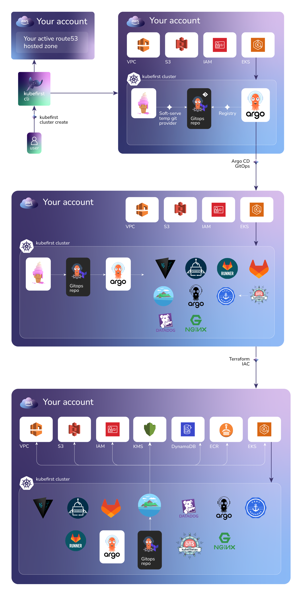

# Platform Installation with the Kubefirst CLI

**Kubefirst** is the name of our command line tool that installs the Kubefirst platform and provides common platform 
operations out of the box.

It installs a fully automated platform of open source cloud native tools with a simple `kubefirst civo create` command.

<!-- todo get image -->
<!--  -->

### CIVO Prerequisites

For your CIVO cloud resources to provision we have a couple prerequisites:    

1. A CIVO account with billing enabled. # note when you get an account you get $200 in credits!

2. an established publicly accessiblec dns ([docs](https://docs.CIVO.amazon.com/Route53/latest/DeveloperGuide/hosted-zones-working-with.html))

3. you'll need [AdministratorAccess](https://console.CIVO.amazon.com/iam/home?#/policies/arn:CIVO:iam::CIVO:policy/AdministratorAccessserviceLevelSummary) to your aws account ([docs](https://docs.aws.amazon.com/general/latest/gr/aws-sec-cred-types.html#access-keys-and-secret-access-keys))

### Step 1 - Download

Download the latest kubefirst cli.

**installation using homebrew**

```
brew install kubefirst/tools/kubefirst
```

**installation using other methods**

There are a number of other ways to install kubefirst for different operating systems, architectures, and containerized environments. Please see our [installation readme](https://github.com/kubefirst/kubefirst/blob/main/build/README.md) for details.

### Step 2 - `kubefirst init`

Then init your local setup providing values for the following flags:

| Flag              | Description                                                                                                                           | Example                   |
| ----------------- | ------------------------------------------------------------------------------------------------------------------------------------- | ------------------------- |
| --admin-email     | an email address that can be used for certificate renewal alerts and the gitlab root account                                          | yourname@yourcompany.com  |
| --cloud           | we only support aws, gcp coming soon                                                                                                  | aws                       |
| --hosted-zone-name| name of the platform's hosted zone domain - this will drive the URLs of your tools (gitlab.yourdomain.com, argocd.yourdomain.com, etc)| yourdomain.com            |
| --region          | name of the aws region in which to place your region specific resources                                                               | us-east-1                 |
| --profile         | name of the aws profile the cli should leverage                                                                                       | default                   |
| --cluster-name    | name of the cluster name, used to identify resources on cloud provider                                                                | your_cluster_name         |
| --s3-suffix       | unique identifier for s3 buckets                                                                                                      | you-s3-bucket-name        |
| --git-provider    | specify \"github\" or \"gitlab\" git provider                                                                                         | gitlab                    |
| --aws-nodes-spot  | nodes spot on AWS EKS compute nodes                                                                                                   | true                      |

```bash
kubefirst init \
--admin-email yourname@yourcompany.com \
--cloud aws \
--hosted-zone-name yourdomain.com \
--region us-east-1 \
--profile default \
--cluster-name your_cluster_name \
--s3-suffix you-s3-bucket-name \
--git-provider gitlab \
--aws-nodes-spot
```

#### Using a config file

```yaml
# config.yaml
config:
  admin-email: your_name@yourcompany.com
  cloud: aws
  hosted-zone-name: yourdomain.com
  region: us-east-1
  profile: default
  cluster-name: your_cluster_name
  s3-suffix: you-s3-bucket-name
  git-provider: gitlab
  aws-nodes-spot: true
```

```bash
export KUBEFIRST_GITHUB_AUTH_TOKEN=your-new-token

kubefirst init -c config.yaml
```

The `init` process produces a directory of utilities, a state file, and some staged platform content that can now be 
found at `~/.kubefirst`. [Here](../../tooling/kubefirst-cli.md) you can find more details about `init` command.
<!-- TODO: check final state file name above - state file collides with directory -->

### Step 3 - `kubefirst cluster create`

Now it's time to create the platform, to do so simply run

```
kubefirst cluster create
```
<!-- TODO: check final state command above - talk through stack vs cluster with team -->
