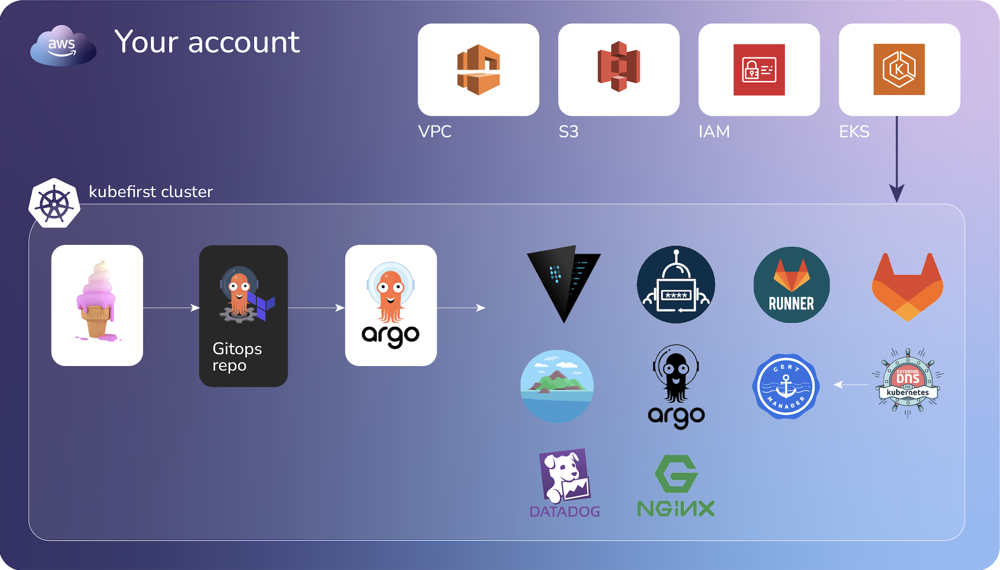
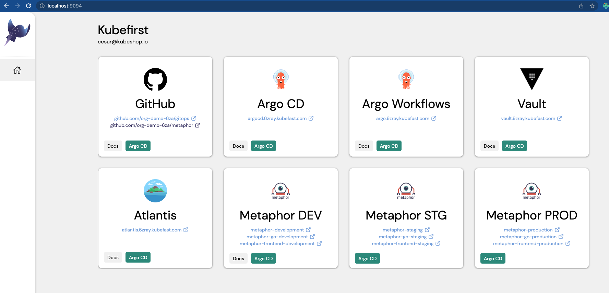
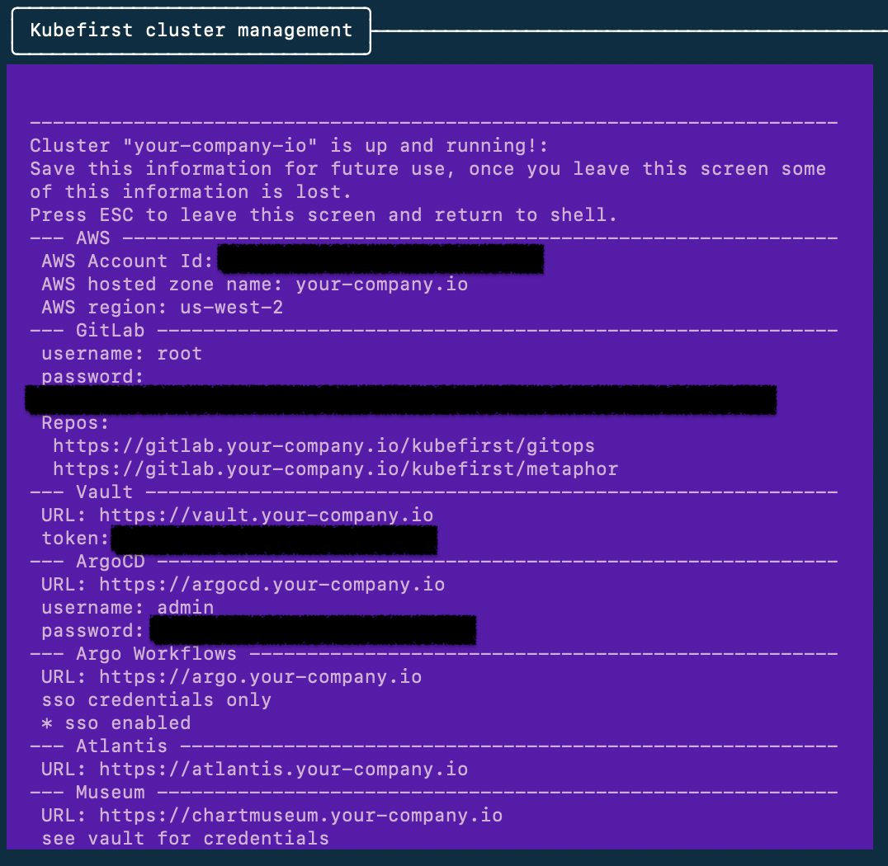

# After Install

[//]: # (`todo: need new getting started video for github`)

[//]: # (<iframe width="784" height="441" src="https://www.youtube.com/embed/KEUOaNMUqOM" title="YouTube video player" frameborder="0" allow="accelerometer; autoplay; clipboard-write; encrypted-media; gyroscope; picture-in-picture" allowfullscreen></iframe>)

The `kubefirst cluster create` execution includes a lot of important information toward the end including URLs and passwords. Do not lose this information. 

You now have an EKS cluster with the following content installed in it:

| Application                  | Description                                                                |
|------------------------------|----------------------------------------------------------------------------|
| Nginx Ingress Controller     | Ingress Controller                                                         |
| Cert Manager                 | Certificate Automation Utility                                             |
| Certificate Issuers          | Let's Encrypt browser-trusted certificates                                 |
| Argo CD                      | GitOps Continuous Delivery                                                 |
| Argo Workflows               | Application Continuous Integration                                         |
| GitHub Action Runner         | GitHub CI Executor                                                         |
| Vault                        | Secrets Management                                                         |
| Atlantis                     | Terraform Workflow Automation                                              |
| External Secrets             | Syncs Kubernetes secrets with Vault secrets                                |
| Chart Museum                 | Helm Chart Registry                                                        |
| Metaphor JS API              | (development, staging, production) instance of sample application          |
| Metaphor Go API              | (development, staging, production) instance of sample go application       |
| Metaphor Frontend            | (development, staging, production) instance of sample frontend application |

- These apps are all managed by Argo CD and the app configurations are in the `gitops` repo's `registry` folder.
- The AWS infrastructure is terraform - that's also in your `gitops` repo, but in your `terraform` folder.



## Step 1: Console UI

Once you run `cluster create` command at the end of the installation will open a new browser tab with the Console UI at
`http://localhost:9094` to provide you a dashboard to navigate through the different services that were previsioned.





These are **not your personal credentials**. These are administrator credentials that can be used if you ever need to 
authenticate and administer your tools if your OIDC provider ever become unavailable. Please protect these secrets and 
store them in a safe place.

## Step 2: Add Your Team

Log into gitlab using the root credentials that were provided to you in your terminal.

Once logged in, navigate to the `gitops` project and edit the file `terraform/users/admin.tf`. In this file, you'll see some blocks that represent admin users:

```
module "admin_one" {
  source   = "./templates/oidc-user"
  admins_group_id    = gitlab_group.admins.id
  developer_group_id = gitlab_group.developer.id
  username           = "admin1"
  fullname           = "Admin One"
  email              = "admin1@yourcompany.com"
  is_admin           = true
}
```

Edit this code replacing the values for the `module name`, `username`, `fullname`, and `email`. There is also a file for your developers at `terraform/users/developers.tf`. You can duplicate those snippets of code in these files to create as many developers and admins as you need.

Commit this change to a **new branch** and create a merge request. This will kick off the Atlantis workflow. Within a minute or so of submitting the merge request, a comment will appear on the merge request that shows the terraform plan with the changes it will be making to your infrastructure. 

To apply these changes, submit a comment on that Merge Request with the following comment text:
```
atlantis apply
```

Doing so will instruct Atlantis to apply the plan. It will report back with the results of the apply within a minute or so.

NOTE: Atlantis merges your Pull Request automatically once an apply is successfully executed. Don't merge terraform merge requests yourself.

Atlantis will always run plans automatically for you when a merge request is opened that changes files mapped in `atlantis.yaml`

Any new users you have created through this process will have their temporary initial passwords stored in Vault. You can access vault using the information provided to you in the terminal as well, and you will find your users' individual initial passwords in the vault secret store `/secrets/users/<username>`. Once you've provided them this initial password, they can update their password throughout the platform by updating their GitLab user password in their gitlab profile.


## Step 3: Deliver Metaphor to Development, Staging, and Production

Metaphor is our sample application that we use to demonstrate parts of the platform and to test CI changes. It's the other project in the Kubefirst group in GitLab.

If you visit its `.gitlab-ci.yml` in the metaphor repo root, you'll see it's sending some workflows to argo. Those workflows are also in the `metaphor` repo in the `.argo` directory.

The metaphor pipeline will:

- publish the metaphor container to your private ecr
- add the metaphor image to a release candidate helm chart and publish it to chartmuseum
- set the metaphor desired helm chart version in the gitops repo for development, then staging
- the release stage of the pipeline will republish the chart, this time without the release candidate notation making it an officially released version, and prepare the metaphor application chart for the next release version
- the officially released chart will be set as the desired helm chart for production

To watch this pipeline occur, make any change to the `main` branch of the `metaphor` repo. If you're not feeling creative, we put a file at `.argo/ci-files/trigger.txt` that you can use. Once a file in `main` is changed, navigate to metaphor's CI/CD in GitLab to see the workflows get submitted to argo workflows.

You can visit the metaphor development, staging, and production apps in your browser to see the versions change as your releases complete and argocd syncs the apps. The metaphor URLs can be found in your gitops and metaphor project `README.md` files.

## Learning the ropes

We've tried our best to surface available customizations and patterns of the kubefirst platform here on our docs site. We've also made [links available](./credit.md) to all of our open source tools' own sources of documentation as well.

You can [reach out to us](../../community/index.md) if you have any issues along the way. We're also available for consultation of where you should take the platform based on your organization's needs. We know the technologies inside and out and would love to help you do the same.
