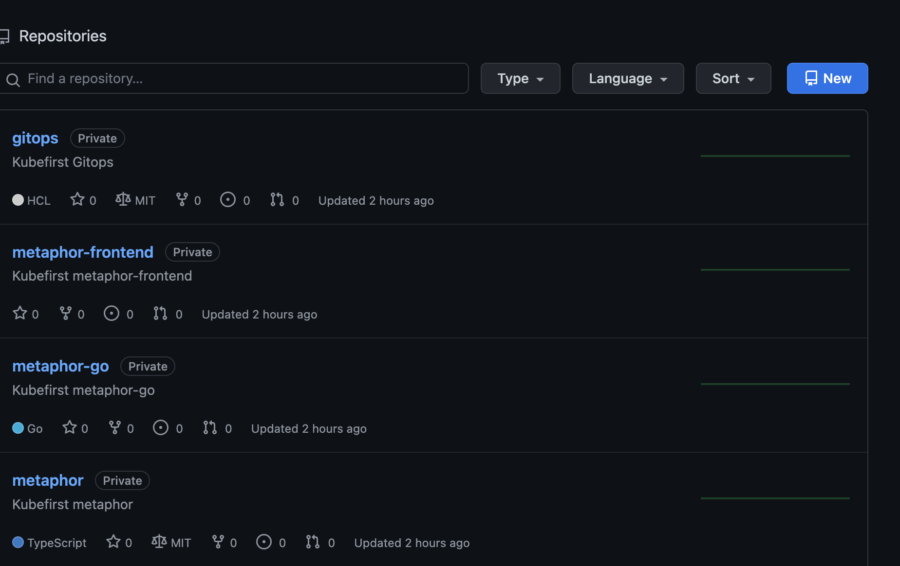

# GitHub Repositories

When you install the GitHub version of Kubefirst, a couple of new repositories will be added to your GitHub organization.



## Repository Summary

`gitops`

The GitOps repo houses all of our IAC and all our GitOps configurations. All the infrastructure that you receive with Kubefirst was produced by some combination of Terraform and ArgoCD. You will add to this repository as your business needs require new infrastructure or new applications.

`metaphor suite`

The Metaphor suite is a set of example applications used to showcase certain features of the Kubefirst platform. The Metaphor apps have CI/CD
that deliver each app to a development, staging, and production namespace in your Kubernetes cluster. The metaphor service apps' secrets in
vault are bound to the metaphor app through the use of external-secrets, a handy Kubernetes utility to keep Kubernetes
secrets in sync with the vault source of truth. It also demonstrates how DNS entries are automatically
created in Route 53 using external-dns. It has auto-renewing, short-lived certificates generated and auto-renewed as well,
using cert-manager and the Let's Encrypt cluster-issuer.


The available Metaphor applications are, **Metaphor (NodeJS API)**, **Metaphor (Go API)** and **Metaphor Frontend**.
The Metaphor applications are describe in more details [here](../../common/metaphors.md).

## GitHub Repository Management

These GitHub repositories are being managed in Terraform.

As you need additional GitHub repositories, just add a new section of Terraform code to `terraform/github/kubefirst-repos.tf`:
```
module "your_repo_name" {
  depends_on = [
    gitlab_group.kubefirst
  ]
  source                                = "./templates/gitlab-repo"
  group_name                            = gitlab_group.kubefirst.id
  repo_name                             = "your-repo-name"
  create_ecr                            = true
  initialize_with_readme                = true
  only_allow_merge_if_pipeline_succeeds = false
  remove_source_branch_after_merge      = true
}
```

GitHub's Terraform provider provides many more configuration options than just these settings. Check them out and add to your 
default settings once you're comfortable with the platform.

Take a look at the `Resources` section of the GitHub provider documentation 
[](https://registry.terraform.io/providers/integrations/github/latest/docs).

That was just GitHub. Take a look at all the Terraform providers that are available; the list of technologies you can 
manage in Terraform is really impressive. [](https://www.terraform.io/docs/providers/index.html)

## Making Terraform Changes

To make infrastructure and configuration changes with Terraform, simply open a merge request in the `gitops` repository.
Your merge request will automatically provide plans, state locks, and applies, and even comment in the merge request 
itself. You'll have a simple, peer reviewable, auditable changelog of all infrastructure and configuration changes.


`todo: need image below for pull request atlantis`


