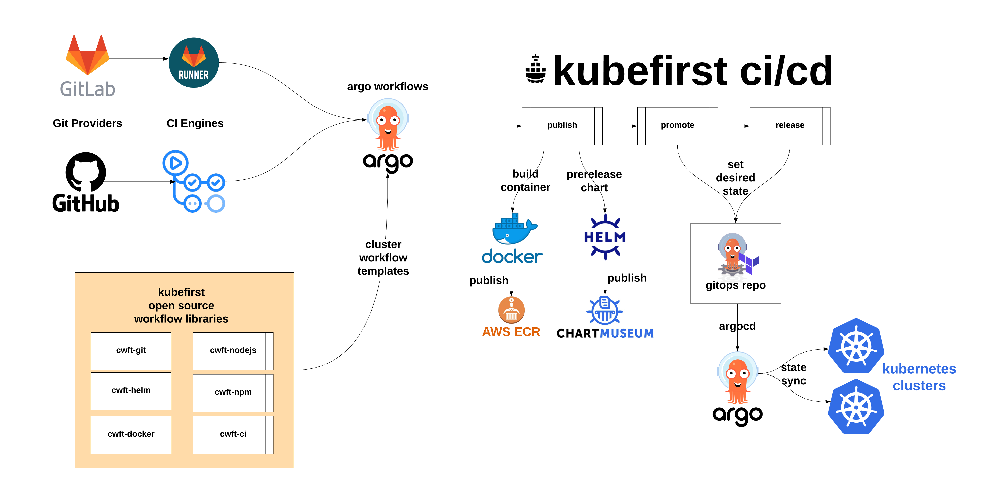
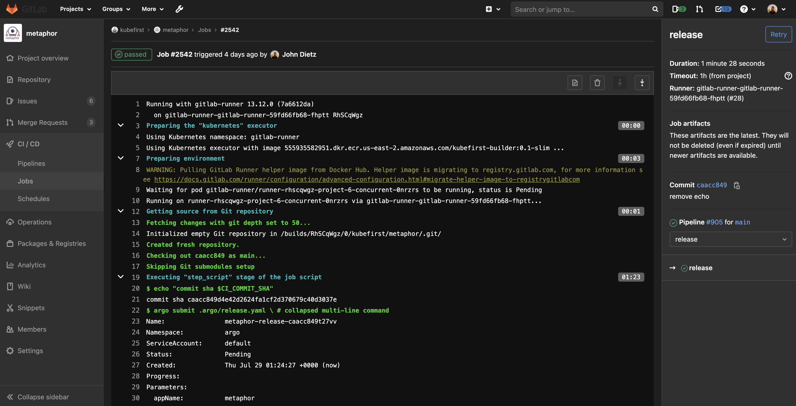
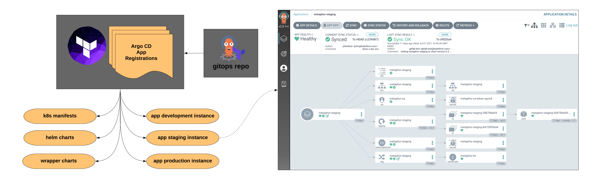

# Kubefirst GitOps CI/CD

## Say Goodbye to Deployment Scripts with GitOps

With our GitOps patterns, the days of scripting `kubectl apply` and `helm install` operations are over. Your pipeline's job to deploy code is to simply to set the version of the app you want in the `main` branch of the `gitops` repository.

## The Benefits of GitOps

The benefit of defining your desired state in a declarative way in Git is enormous.

- An audit log of every system change including who made and who approved the change is available.
- A secure main branch of the GitOps repo makes for very easy security and approval controls for system changes.
- Easy to understand rollbacks (just revert the Git commit that caused the problem and you'll be on the last version).
- The declarative state in Git significantly reduces the complexity of disaster recovery.
- Creating new environments is as straight-forward as duplicating directory structures.
- Having everything declared in the GitOps repo means everyone can agree to the source of truth for every version of every app.

## See How Rollbacks Work
<div class="video-wrapper">
  <iframe width="1280" height="500" src="https://www.youtube.com/embed/iqZA9Eycvgo" frameborder="0" allowfullscreen></iframe>
</div>

## Pipelines



Our CI pipelines originate in your privately hosted GitHub Actions Runner with a workflow being submitted to Argo Workflows. The workflows will publish your container with a pre-release Helm chart.

The pipelines then continue with promotion of the release through the preprod environments.

Once the release is ready, the release chart is published and delivered to production, and the application chart's version will be prepared for the next release.

## GitHub Integration with Argo Workflows


`todo: need new image for github integration`



The integration that we've established between GitHub and Argo Workflows will surface your powerful Argo Workflows engine directly in GitHub Actions, so that your developers have all of the workflow execution information available, directly associated with their commit in their application repository.

This provides all of the CI observability your development team needs directly associated with their change in Git.

## GitOps Resources



Our implementation includes GitOps patterns for numerous source types including:

- Helm Charts
- Wrapper Charts
- Kubernetes Manifest Files

The metaphor example application includes an example of how easy it is to set different configuration overrides for your different environments.

To see what it takes to make the `development` instance of `metaphor` different than the others, visit the `gitops` repo and navigate to `/components/development/metaphor/values.yaml`

```yaml
metaphor:
  ingress:
    enabled: true
    annotations:
      kubernetes.io/ingress.class: nginx
      cert-manager.io/cluster-issuer: "letsencrypt-prod"
    hosts:
      - host: metaphor-development.your-company.io
        paths:
          - /
    tls:
    - secretName: metaphor-tls
      hosts:
        - metaphor-development.your-company.io
  vaultMountPoint: kubefirst
  vaultSecretPath: development/metaphor
```

Any Helm value that should deviate from the default chart can be set here so your environment overrides are always concise and clear.
