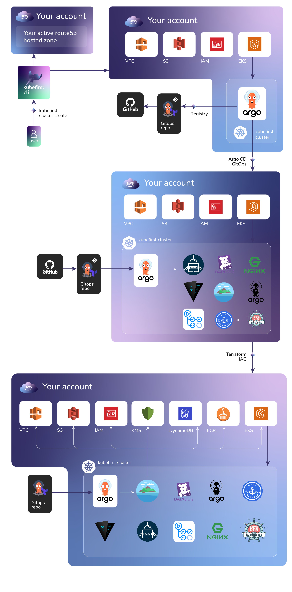

# Platform Installation with the Kubefirst CLI

**Kubefirst** is the name of our command line tool that installs the Kubefirst platform and provides some platform
conveniences.

It installs a fully automated platform of open source cloud native tools with a simple
[init](../../tooling/kubefirst-cli.md) and [create](../../tooling/kubefirst-cli.md) command.



### Prerequisites

- [To install kubefirst CLI](../overview.html#how-to-install-kubefirst-cli)

**AWS Prerequisites**

1. Create an AWS account with billing enabled.

2. Establish a public hosted zone with dns routing established([docs](https://docs.aws.amazon.com/Route53/latest/DeveloperGuide/hosted-zones-working-with.html)).

3. Connect with [AdministratorAccess](https://console.aws.amazon.com/iam/home?#/policies/arn:aws:iam::aws:policy/AdministratorAccessserviceLevelSummary) IAM credentials to your AWS account ([docs](https://docs.aws.amazon.com/general/latest/gr/aws-sec-cred-types.html#access-keys-and-secret-access-keys)).


### Step 1 - Create your kubefirst bot user and a personal access token

The kubefirst cli will automatically create one admin user for you. We refer to this initial user as the `kubefirst bot`. After the installation, you will temporarily use that `kubefirst bot` to onboard yourself and the rest your team to the platform. From that point forward, the kubefirst bot should only be used for automated activities, and you can use your own personal account.

This kubefirst bot user needs to be associated with a GitHub user account. Log out of GitHub and create a new GitHub account to represent this new `kubefirst bot` account. Because this account will be used for automation, it's a good to choose a username that generically represents your company or project name - something like yourcompany-bot is a good idea. You can also have fun with it and give your bot a fun name - the point is that this is not an account for your long term personal use, it's for the kubefirst system to use.

Your new bot account will need to be associated with a GitHub organization.

- If you don't already have one that you want to use, while logged into GitHub with your new bot account, establish a new [GitHub organization](https://docs.github.com/en/organizations/collaborating-with-groups-in-organizations/creating-a-new-organization-from-scratch).
- If you do already have a GitHub org that you want to add Kubefirst to, you'll need to add your new kubefirst bot to the existing organization now.


#### GitHub Authorization during install

Kubefirst utilizes the user's GitHub token to generate resources within the user's GitHub account, [details](../../common/github-token.md).

At the beginning of the installation, Kubefirst will ask you to generate the GitHub token.

### Step 2 - `kubefirst init`

Let's init your local setup providing values for the following flags:

| Flag               | Description                                                                                                                            | Example                   |
| ------------------ | -------------------------------------------------------------------------------------------------------------------------------------- | ------------------------- |
| --admin-email      | an email address that can be used for certificate renewal alerts                                           | your_name@yourcompany.com |
| --cloud            | we only support aws, gcp coming soon                                                                                                   | aws                       |
| --hosted-zone-name | name of the platform's hosted zone domain - this will drive the URLs of your tools (gitlab.yourdomain.com, argocd.yourdomain.com, etc) | yourdomain.com            |
| --cluster-name     | the name of your cluster                                                                                                               | your_cluster_name         |
| --region           | name of the aws region in which to place your region specific resources                                                                | us-east-1                 |
| --profile          | name of the aws profile the cli should leverage                                                                                        | default                   |
| --s3-suffix        | unique identifier for s3 buckets                                                                                                       | you-s3-bucket-name        |
| --github-owner       | name of your github organization name                                                                                                  | your_organization         |
| --aws-nodes-graviton| Graviton nodes (ARM) on AWS EKS compute nodes                                                                                         | true                      |
| --aws-nodes-spot   | nodes spot on AWS EKS compute nodes                                                                                                    | true                      |

```bash
kubefirst init \
--admin-email yourname@yourcompany.com \
--cloud aws \
--hosted-zone-name yourdomain.com \
--region us-east-1 \
--profile default \
--cluster-name your-cluster-name \
--github-owner your-github-organization-name
```


#### Using a config file

```yaml 
# config.yaml
config:
  admin-email:  yourname@yourcompany.com 
  hosted-zone-name: yourdomain.com
  region: us-east-1 
  profile: default
  cluster-name: your-cluster-name
  github-owner: your-github-organization-name
```

```bash 
kubefirst init  -c ./config.yaml  --cloud aws 
```
> - The flag `--cloud` is not supported via config file

The `init` process produces a directory of utilities, a state file, and some staged platform content that can now be found at `~/.kubefirst`

### Step 3 - `kubefirst cluster create`

Now it's time to create the platform, to do so, simply run

```
kubefirst cluster create
```

## What to do next

Continue your journey: 

- [Explore your installation](./explore.md)
- [Destroying](./destroy.md)
