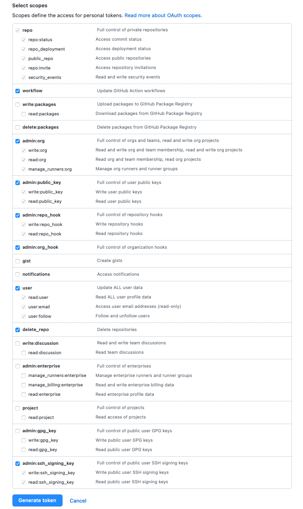

# Platform Installation with the Kubefirst CLI

**Kubefirst** is the name of our command line tool that installs the Kubefirst platform and provides some platform 
conveniences.

It installs a fully automated platform of open source cloud native tools with a simple 
[init](../../tooling/kubefirst-cli.md) and [create](../../tooling/kubefirst-cli.md) command.


### Prerequisites

**AWS Prerequisites**

1. Create an AWS account with billing enabled.

2. Establish a public hosted zone with dns routing established([docs](https://docs.aws.amazon.com/Route53/latest/DeveloperGuide/hosted-zones-working-with.html)).

3. Connect with [AdministratorAccess](https://console.aws.amazon.com/iam/home?#/policies/arn:aws:iam::aws:policy/AdministratorAccessserviceLevelSummary) IAM credentials to your AWS account ([docs](https://docs.aws.amazon.com/general/latest/gr/aws-sec-cred-types.html#access-keys-and-secret-access-keys)).

**GitHub Prerequisites**

1. Establish a [GitHub organization](https://docs.github.com/en/organizations/collaborating-with-groups-in-organizations/creating-a-new-organization-from-scratch).

### Step 1 - Download

Download the latest Kubefirst CLI.

**Installation Using Homebrew**

```
brew install kubefirst/tools/kubefirst
```

**Installation Using Other Methods**

There are a number of other ways to install Kubefirst for different operating systems, architectures, and containerized environments. Please see our [installation readme](https://github.com/kubefirst/kubefirst/blob/main/build/README.md) for details.

### Step 2 - Create a user GitHub personal access token

Go to your [GitHub](https://www.github.com) account / **Settings** / **Personal access tokens**, and generate a new 
token with the following permissions:




Expose the token for your local environment:

```
export GITHUB_AUTH_TOKEN=your-new-token
```

### Step 3 - `kubefirst init`

Then init your local setup providing values for the following flags:

| Flag               | Description                                                                                                                            | Example                    |
|--------------------|----------------------------------------------------------------------------------------------------------------------------------------|----------------------------|
| --admin-email      | an email address that can be used for certificate renewal alerts and the gitlab root account                                           | your_name@yourcompany.com  |
| --cloud            | we only support aws, gcp coming soon                                                                                                   | aws                        |
| --hosted-zone-name | name of the platform's hosted zone domain - this will drive the URLs of your tools (gitlab.yourdomain.com, argocd.yourdomain.com, etc) | yourdomain.com             |
| --cluster-name     | the name of your cluster                                                                                                               | my_kubefirst_cluster       |
| --region           | name of the aws region in which to place your region specific resources                                                                | us-east-1                  |
| --profile          | name of the aws profile the cli should leverage                                                                                        | default                    |
| --github-user      |                                                                                                                                        | your_username              |
| --github-org       | your_organization                                                                                                                      | your_organization          |

```
kubefirst init \
    --admin-email yourname@yourcompany.com \
    --cloud aws --hosted-zone-name yourdomain.com \
    --region us-east-1 \
    --profile default \
    --cluster-name my_kubefirst_cluster \
    --github-user your_username \
    --github-org your_organization
```

The `init` process produces a directory of utilities, a state file, and some staged platform content that can now be found at `~/.kubefirst`
<!-- TODO: check final state file name above - state file collides with directory -->

### Step 3 - `kubefirst cluster create`

Now it's time to create the platform, to do so, simply run

```
kubefirst cluster create
```
<!-- TODO: check final state command above - talk through stack vs cluster with team -->
