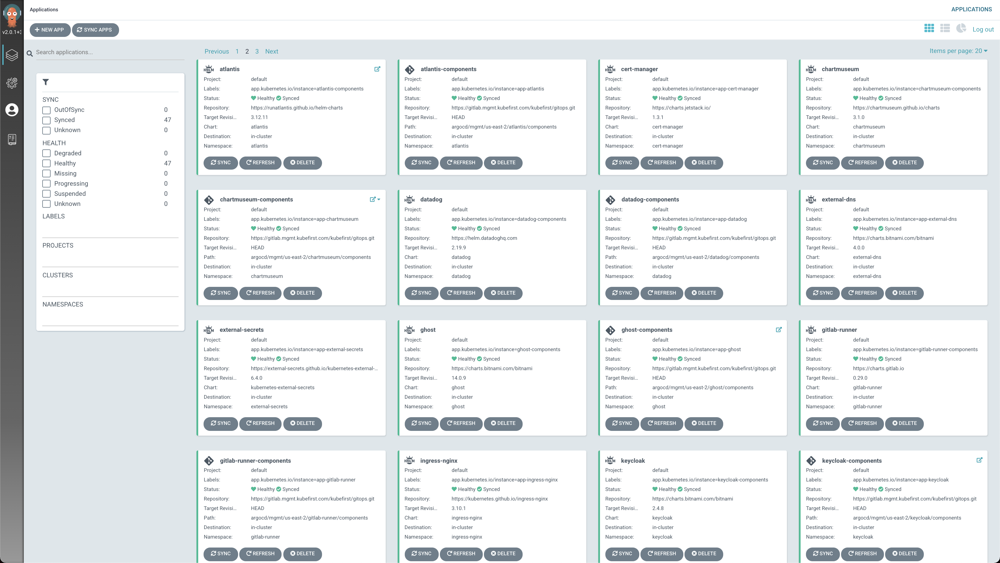
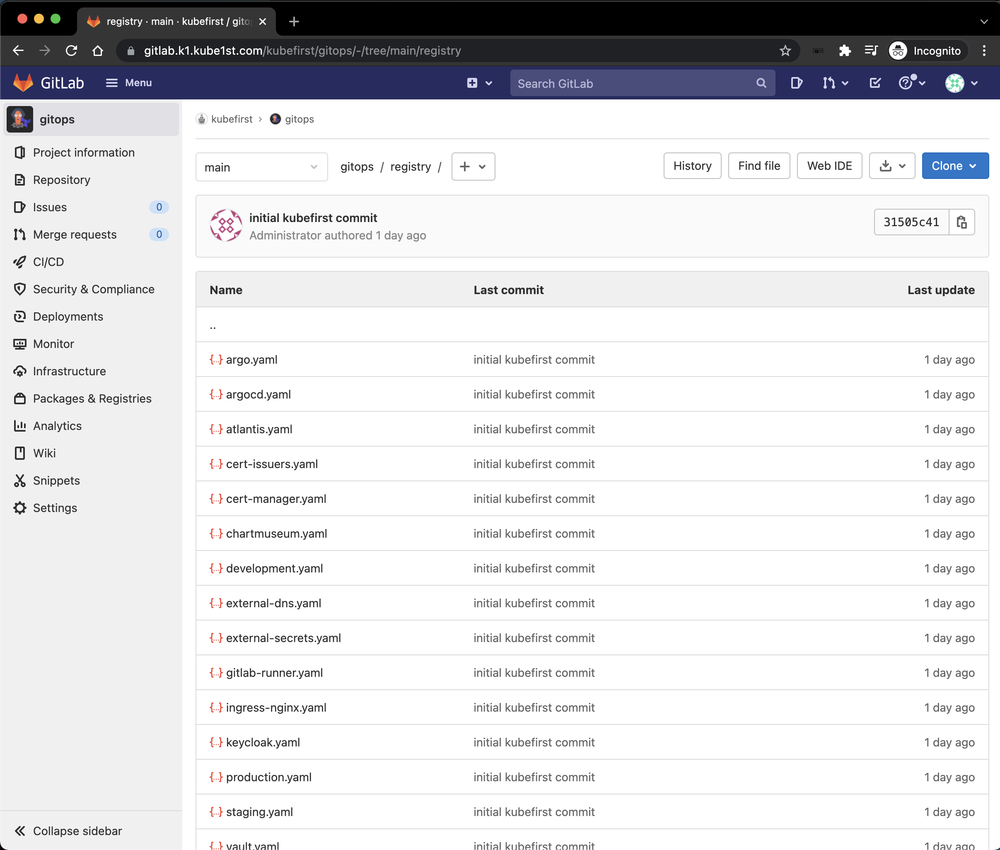

# Argo CD

Argo CD is a GitOps oriented continuous delivery tool for kubernetes. We use it to manage all of our applications across our kubernetes clusters.

Argo CD is really great at providing a straightforward mechanism for you to manage Helm charts, their versions, their configuration overrides, and whether their state is in sync with what is running on your clusters.

## Managing Apps in Argo CD

Our Kubernetes apps can be found in our `gitops` repository at path `/registry`.

Each of these yaml files will include details regarding the application's source, destination, and Helm configuration overrides.

## Applying Changes in Argo CD

Once you change the desired state of the app in the `gitops` repository `main` branch, the registered app-of-apps will sync, and any apps that need adjustment will automatically sync with the state that's in git. 

## Adding applications to ArgoCD

The registry of our Argo CD apps are all in the `/registry` root directory. Any application added here will be added to argocd. An app can also be an app-of-apps if you require multiple components to be deliveres as a suite. You'll see plenty of examples to follow in the `/registry` directory.

## External Docs

[https://argoproj.github.io/argo-cd/](https://argoproj.github.io/argo-cd/)
