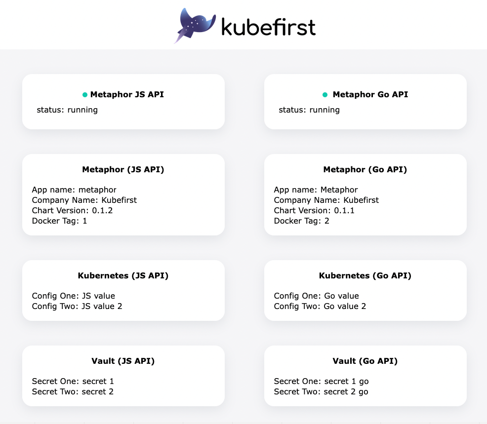

# Explore

**psssst** *- if you plan to destroy your kubefirst platform and recreate it again we recommend running `kubefirst backupSSL --include-metaphor` to re-use your ssl certs from Let's Encrypt. See the [docs](https://docs.kubefirst.io/common/certificates.html#backup-and-restore-certificates).*

<iframe width="784" height="441" src="https://www.youtube.com/embed/KEUOaNMUqOM" title="YouTube video player" frameborder="0" allow="accelerometer; autoplay; clipboard-write; encrypted-media; gyroscope; picture-in-picture" allowfullscreen></iframe>

The `kubefirst cluster create` execution includes a lot of important information toward the end including URLs and passwords. Do not lose this information. 

You now have an EKS cluster with the following content installed in it:

| Application              | Description                                 |
|--------------------------|---------------------------------------------|
| Nginx Ingress Controller | Ingress Controller                          |
| Cert Manager             | Certificate Automation Utility              |
| Certificate Issuers      | Let's Encrypt browser-trusted certificates  |
| Argo CD                  | GitOps Continuous Delivery                  |
| Argo Workflows           | Application Continuous Integration          |
| GitLab                   | GitLab Server                               |
| GitLab Runner            | GitLab CI Executor                          |
| Vault                    | Secrets Management                          |
| Atlantis                 | Terraform Workflow Automation               |
| External Secrets         | Syncs Kubernetes secrets with Vault secrets |
| Chart Museum             | Helm Chart Registry                         |
| Metaphor Development     | Development instance of sample application  |
| Metaphor Staging         | Staging instance of sample application      |
| Metaphor Production      | Production instance of sample application   |

- These apps are all managed by Argo CD and the app configurations are in the `gitops` repo's `registry` folder.
- The AWS infrastructure is terraform - that's also in your `gitops` repo, but in your `terraform` folder.

## Step 1: Console UI

Once you run the `cluster create` command at the end of the installation, a new browser tab will open with the Console UI at
`http://localhost:9094` to provide you a dashboard to navigate through the different services that were previsioned.

These are **not your personal credentials**. These are administrator credentials that can be used if you ever need to 
authenticate and administer your tools if your OIDC provider ever become unavailable. Please protect these secrets and 
store them in a safe place.

## Step 2: Add Your Team(optional)

This step is meant to explore the onboarding process of a new user to your installation:

- [Explore Atlantis & Terraform to manage users](../../../common/terraform/#how-can-i-use-atlantis-to-add-a-new-user-on-my-gitlab-backed-installation)

## Step 3: Deliver Metaphors to Development, Staging, and Production

Metaphors are our sample applications that we use to demonstrate parts of the platform and to test CI changes. It's the 
other project in the Kubefirst group in GitLab.

If you visit its `.gitlab-ci.yml` in the metaphors repositories root, you'll see it's sending some workflows to argo. 
Those workflows are also in the `metaphors` repo in the `.argo` directory.

The metaphor pipeline will:

- publish the metaphor container to your private ecr
- add the metaphor image to a release candidate helm chart and publish it to chartmuseum
- set the metaphor desired helm chart version in the gitops repo for development, then staging
- the release stage of the pipeline will republish the chart, this time without the release candidate notation making it an officially released version, and prepare the metaphor application chart for the next release version
- the officially released chart will be set as the desired helm chart for production

To watch this pipeline occur, make any change to the `main` branch of the `metaphors` repo. If you're not feeling 
creative, we put a file at `.argo/ci-files/trigger.txt` that you can use. Once a file in `main` is changed, navigate to 
metaphor's CI/CD in GitLab to see the workflows get submitted to argo workflows.

You can visit the metaphor development, staging, and production apps in your browser to see the versions change as your 
releases complete and argocd syncs the apps. The metaphor URLs can be found in your gitops and metaphor project 
`README.md` files.

## Learning the Ropes

We've tried our best to surface available customizations and patterns of the Kubefirst platform here on our docs site. We've also made [links available](./credit.md) to all of our open source tools' own sources of documentation as well.

You can [reach out to us](../../community/index.md) if you have any issues along the way. We're also available for consultation about where you should take the platform based on your organization's needs. We know the technologies inside and out and would love to help you do the same.

## What to do next

Continue your journey: 

- [Destroying](../destroy/)
