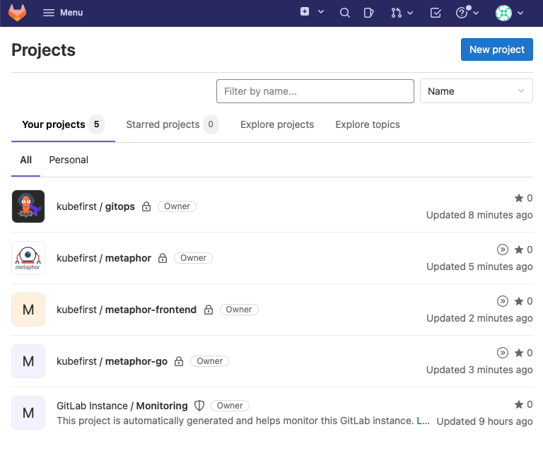
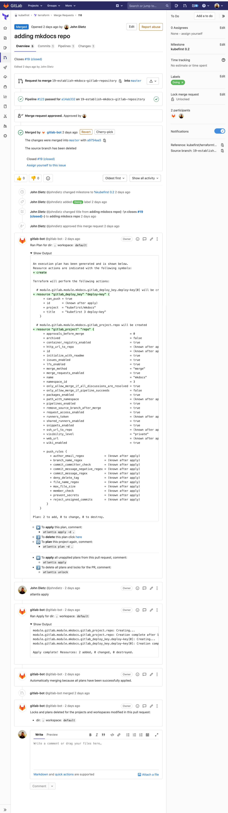

# GitLab Repositories

In the GitOps nature, we rely on repositories to have a single source of truth when it comes to project updates. 
Kubefirst makes heavy use of the GitOps approach to automate the development and maintenance of applications. In that regard,
during the installation process, Kubefirst will bring up few GitLab repositories as described below.

## Repositories



`gitops`

The GitOps repo houses all of our IAC and all of our GitOps configurations. All of the infrastructure that you receive 
with Kubefirst was produced by Terraform and all of your applications are delivered with Argo CD. You will add to this 
GitOps repository as your business needs require additional infrastructure or applications.

`metaphors`

Metaphors are example applications used to showcase certain features of the Kubefirst platform. Metaphors has CI/CD 
that delivers the app to a development, staging, and production namespace in your Kubernetes cluster. Its secrets in 
Vault are bound to the Metaphor app through the use of external-secrets, a handy Kubernetes utility to keep Kubernetes 
secrets in sync with the Vault source of truth. It also demonstrates how DNS entries will be automatically 
created in route53 using external-dns. It has auto-renewing short-lived certificates generated and auto-renewed as well 
using cert-manager and the Let's Encrypt cluster-issuer.

The available Metaphor applications are **Metaphor (NodeJS API)**, **Metaphor (Go API)** and **Metaphor Frontend**.
The Metaphor applications are describe in more details [here](../../common/metaphors.md).

## GitLab Repository Management

These GitLab repositories are being managed in Terraform.

As you need additional GitLab repositories, just add a new section of Terraform code to 
`terraform/gitlab/kubefirst-repos.tf`

```
module "your_repo_name" {
  depends_on = [
    gitlab_group.kubefirst
  ]
  source                                = "./templates/gitlab-repo"
  group_name                            = gitlab_group.kubefirst.id
  repo_name                             = "your-repo-name"
  create_ecr                            = true
  initialize_with_readme                = true
  only_allow_merge_if_pipeline_succeeds = false
  remove_source_branch_after_merge      = true
}
```

GitLab's Terraform provider provides many more configuration options than just these settings. Check them out and add to your 
default settings once you're comfortable with the platform.

Take a look at the `Resources` section of the 
[GitLab provider documentation](https://registry.terraform.io/providers/gitlabhq/gitlab/latest/docs/resources).

That was just GitLab. Take a look at all of the Terraform providers that are available, the list of technologies you 
can manage in Terraform is really getting impressive. [](https://www.terraform.io/docs/providers/index.html)

## Making Terraform Changes

To make infrastructure and configuration changes with Terraform, simply open a merge request in the `gitops` repository.
Your merge request will automatically provide plans, state locks, and applies, and even comment in the merge request 
itself. You'll have a simple, peer reviewable, auditable changelog of all infrastructure and configuration changes.


