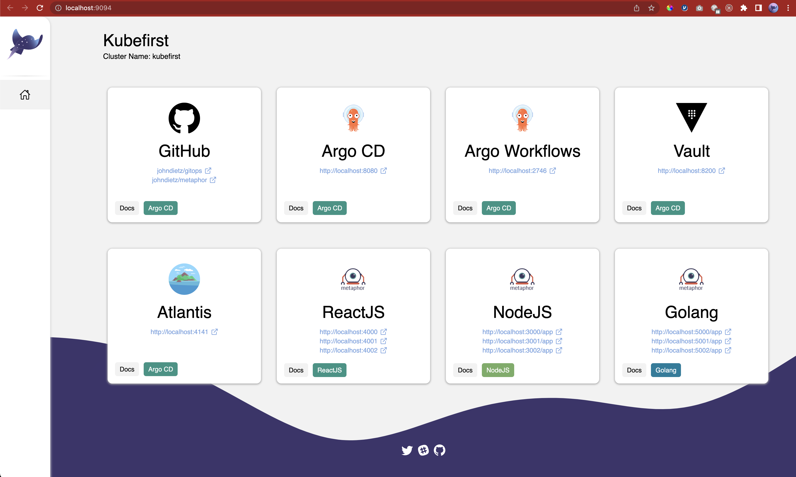
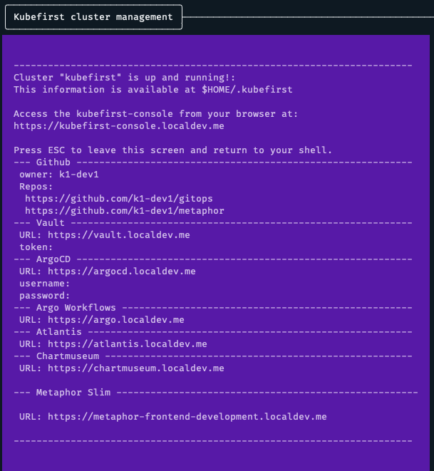
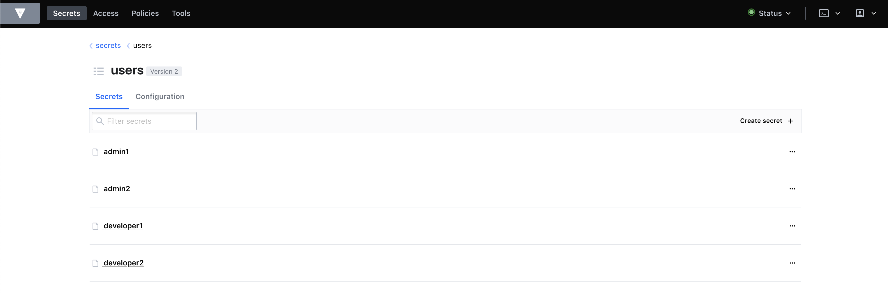

# After Install

[//]: # (`todo: need new getting started video for github local`)

[//]: # (<iframe width="784" height="441" src="https://www.youtube.com/embed/KEUOaNMUqOM" title="YouTube video player" frameborder="0" allow="accelerometer; autoplay; clipboard-write; encrypted-media; gyroscope; picture-in-picture" allowfullscreen></iframe>)

The `kubefirst local` execution includes important information toward the end, including URLs and passwords to get to your port-forwarded applications. The applications are available while the handoff screen remains active. If you ever need to reconnect to all of your services, you can do so with a kubefirst

You now have a k3d cluster with the following content installed in it:

| Application                  | Description                                                                |
|------------------------------|----------------------------------------------------------------------------|
| Traefik Ingress Controller   | Native k3d Ingress Controller                                              |
| Cert Manager                 | Certificate Automation Utility                                             |
| Argo CD                      | GitOps Continuous Delivery                                                 |
| Argo Workflows               | Application Continuous Integration                                         |
| GitHub Action Runner         | GitHub CI Executor                                                         |
| Vault                        | Secrets Management                                                         |
| Atlantis                     | Terraform Workflow Automation                                              |
| External Secrets             | Syncs Kubernetes secrets with Vault secrets                                |
| Chart Museum                 | Helm Chart Registry                                                        |
| Metaphor                     | (development, staging, production) instance of sample nodejs backend app   |
| Metaphor Go                  | (development, staging, production) instance of sample golang backend app   |
| Metaphor Frontend            | (development, staging, production) instance of sample react frontend app   |

- These apps are all managed by Argo CD and the app configurations are in the `gitops` repo's `registry` folder.
- The AWS infrastructure is terraform - that's also in your `gitops` repo, but in your `terraform` folder.

## Step 1: Console UI



The `kubefirst local` command will open a new browser tab at completion with the Console UI at
`https://kubefirst-console.localdev.me` to provide you an easy way to navigate through the different services that were provisioned.



If you cancel this command and lose these connection, you can reestablish this connectivity using the command `kubefirst local connect`.

## Step 2: Make your first automated Terraform change

Go to your new gitops repository in your personal GitHub. Navigate to the `gitops` project and edit the file `terraform/users/admin.tf`. In this file, you'll see some blocks that represent admin users:

```
module "admin_one" {
  source   = "./templates/oidc-user"
  admins_group_id    = gitlab_group.admins.id
  developer_group_id = gitlab_group.developer.id
  username           = "admin1"
  fullname           = "Admin One"
  email              = "admin1@yourcompany.com"
  is_admin           = true
}
```

Edit this code to replace the values for the `module name`, `username`, `fullname`, and `email`. There is also a file for your developers at `terraform/users/developers.tf`. You can duplicate those snippets of code in these files to create as many developers and admins as you need.

Commit this change to a **new branch** and create a merge request. This will kick off the Atlantis workflow. Within a minute or so of submitting the merge request, a comment will appear on the merge request that shows the terraform plan with the changes it will be making to your infrastructure. 

To apply these changes, submit a comment on that Merge Request with the following comment text:
```
atlantis apply
```

Doing so will instruct Atlantis to apply the plan. It will report back with the results of the apply within a minute or so.

NOTE: Atlantis merges your Pull Request automatically once an apply is successfully executed. Don't merge Terraform merge requests yourself.

Atlantis will always run plans automatically for you when a merge request is opened that changes files mapped in `atlantis.yaml`

Any new users you have created through this process will have their temporary initial passwords stored in Vault. You can access Vault using the information provided to you in the terminal as well, and you will find your users' individual initial passwords in the Vault secret store `/secrets/users/<username>`. Once you've provided them this initial password, they can update their password throughout the platform by updating their GitLab user password in their Gitlab profile.



## Step 3: Deliver Metaphor to Development, Staging, and Production

The Metaphor suite is a set of sample applications that we use to demonstrate parts of the platform and to test CI changes.

If you visit its `/.github/workflows/main.yaml` in one of the metaphor repos, you'll see it's just sending some workflows to argo workflows in your local k3d cluster. Those argo workflows are also in the `metaphor` repos in the `.argo` directory.

The example delivery pipeline will:

- Publish the metaphor container to your private github.
- add the metaphor image to a release candidate helm chart and publish it to chartmuseum
- set the metaphor with the desired Helm chart version in the GitOps repo for development and staging
- the release stage of the pipeline will republish the chart, this time without the release candidate notation making it an officially released version and prepare the metaphor application chart for the next release version
- the officially released chart will be set as the desired Helm chart for production.

To watch this pipeline occur, make any change to the `main` branch of one of the `metaphor` repos. If you're not feeling creative, you can just add a newline to the `README.md`. Once a file in `main` is changed, navigate to metaphor's CI/CD in the github Actions tab to see the workflows get submitted to Argo workflows.

You can visit the metaphor development, staging, and production apps in your browser to see the versions change as you complete resources and ArgoCD syncs the apps. The metaphor URLs can be found in your GitOps and metaphor project `README.md` files.

## Learning the Ropes

We've tried our best to provide the available customizations and patterns of the Kubefirst platform here on our docs site. We've also made [links available](./credit.md) to all of our open source tool's sources of documentation.

You can [reach out to us](../../community/index.md) if you have any issues along the way. We're also available for consultation of where you should take the platform based on your organization's needs. We know the technologies inside and out and would love to help you do the same.
