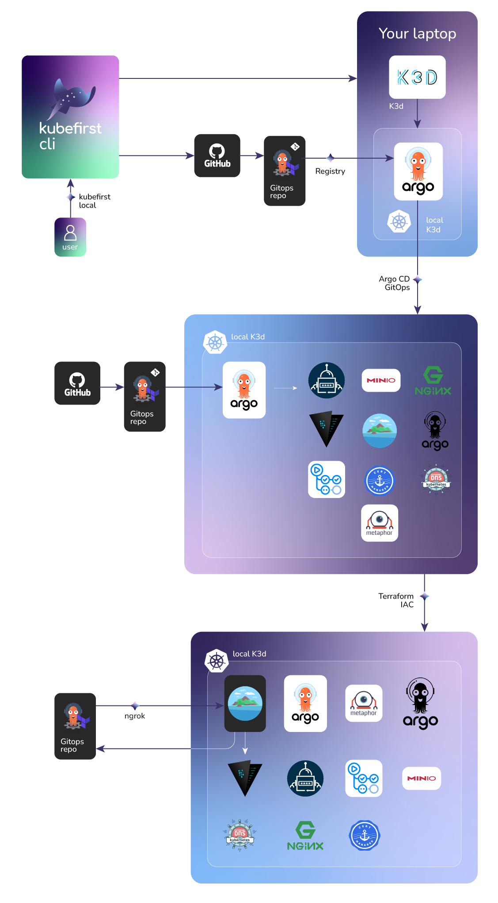

# Local Installation with the Kubefirst CLI

**Kubefirst** is the name of our command line tool that installs the Kubefirst platform to your local or cloud environment.

To use the local version of Kubefirst, you will need to have [Docker installed](https://docs.docker.com/get-docker/). You will also need a GitHub account: GitLab for local, and local git repositories are not supported yet.



### Prerequisites

- [To install kubefirst CLI](../overview.html#how-to-install-kubefirst-cli)
- [To install docker](../https://docs.docker.com/get-docker/)
- [A github account, without an existing repo named 'gitops'](../https://github.com/)

## Create your new local cluster

To create a new Kubefirst cluster locally, run

```shell
kubefirst local
```

If your run is not successful, errors and troubleshooting information will be stored in a local log file specified during the installation run.

This will be followed by the  the instructions prompt to populate the KUBEFIRST_GITHUB_AUTH_TOKEN env variable. Press ENTER and follow the prompt.

The installation process may take a few minutes. If you are successful you should see:

```shell
Cluster "kubefirst" is up and running!
```

### Installed Applications

A newly created local KubeFirst cluster contains:

- A private repo named `gitops`. The applications that you build and release on the kubefirst platform will also be registered here in the development, staging, and production folders. 
- [Argo CD](../https://github.com/argoproj/argo-cd) - GitOps Continuous Delivery
- [Argo Workflows](../https://argoproj.github.io/argo-workflows/) - Application Continuous Integration
- [Atlantis](../https://www.runatlantis.io/) - Terraform Workflow Automation
- [Certificate Issuers](../https://letsencrypt.org/certificates/) - Let's Encrypt browser-trusted certificates
- [Cert Manager](../https://github.com/cert-manager/cert-manager) - Certificate Automation Utility
- [Chart Museum](../https://github.com/helm/chartmuseum) - Helm Chart Registry
- [External Secrets](../https://github.com/external-secrets/kubernetes-external-secrets) - Syncs Kubernetes secrets with Vault secrets
- [GitHub Action Runner](../https://github.com/features/actions) - Self Hosted GitHub Action Runner
- [Nginx Ingress Controller](../https://docs.nginx.com/nginx-ingress-controller/intro/overview/) - Ingress Controller
- [Metaphor](../https://github.com/kubefirst/metaphor-frontend-template) - A sample app to demonstrate CI/CD in on Kubernetes. Contains Devlopment, Staging, and Production environments.
- [Vault](../https://github.com/hashicorp/vault) - Secrets Management


### GitHub Authorization during install

Kubefirst utilizes the user's GitHub token to generate resources within the user's GitHub account, [details](../../common/github-token.md).

At the beginning of the installation, Kubefirst will ask you to generate the GitHub token.

#### Why the Kubefirst cli needs this access

The [gitops repo](https://github.com/kubefirst/gitops-template) that we create for you will power your local Kubefirst platform. The [metaphor-frontend](https://github.com/kubefirst/metaphor-frontend-template) repo is your microservice example, which demonstrate how to publish and gitops-deliver applications to your new development, staging, and production namespaces in your new local cluster.

### How to resolve HTTPS Certificate Warnings

To increase the experience of Cloud running Kubefirst locally, we use [Mkcert](https://github.com/FiloSottile/mkcert) to generate local certificates and serve `https` with Linkerd Ingress Controller.
During installation, we generate these certificates and push them to Kubernetes as secrets to attach to Ingress resources.
Since the certificates are auto-assigned, the browser doesn't recognize them as trusted certificates. 
To resolve the warning that the browser shows when you access one of your applications,  we recommend to run the command:
```shel
mkcert -install
```
We recommend that you run this command above to avoid asking for your password and that you can understand with transparency why a superuser password is requested.

This step will install the CA (Certificate Authority) of MkCert in your trusted store and will make the browser trust in certificates generated by your Kubefirst local install.

### Atlantis and ngrok integration

During cluster provisioning, Terraform communicates with the host machine to create the desired resources. When Atlantis is installed via Kubefirst, it will use ngrok to expose the Atlantis server to the internet via webhook.

Webhooks are the way GitHub listen to events, and forward the request to a service. As an example, when a new commit is pushed to a repository, Atlantis will receive an event call, and run a plan.

ngrok is a tool that allows us to expose a local server to the internet via a tunnel, Kubefirst opens the tunnel during the installation, and Atlantis receive the events via the tunnel. When the installation finish, it hangs at the handoff screen. The tunnel will be closed once the handoff screen is closed, and the Kubefirst installation process dies.

## After installation

After the ~5 minutes installation, your browser will launch a new tab to the [Kubefirst Console application](https://github.com/kubefirst/console), which will help you navigate your new suite of tools running in your local k3d cluster.

Continue your journey: 

- [Explore your installation](./explore.md)
- [Destroying](./destroy.md)
