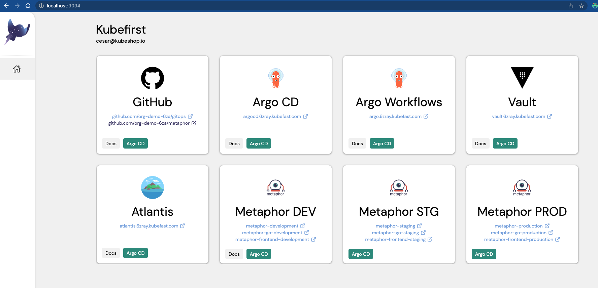

# What is Kubefirst?

Kubefirst is a fully automated and operational open source platform that includes some of the best tools available in the 
Kubernetes space, all working together from a single command. By running `kubefirst cluster create` against your empty 
AWS cloud account, you'll get a GitOps cloud management and application delivery ecosystem complete with automated 
Terraform workflows, Vault secrets management, **GitLab** or **GitHub** integrations with Argo, and demo applications 
that demonstrate how it all pieces together.

If you don't want to use your AWS account and test on your machine, `kubefirst local` provide a very similar experience without using any cloud. 

## How to install Kubefirst CLI

```shell
brew install kubefirst/tools/kubefirst
```

There are a few other ways to install Kubefirst for different operating systems, architectures, and containerized environments. See our [installation README](https://github.com/kubefirst/kubefirst/blob/main/build/README.md) for non-brew details.

To upgrade an existing Kubefirst install to the latest version run

```shell
brew update
brew upgrade kubefirst
```

**Kubefirst dependencies**: brew install will download [AWS IAM Authenticator](https://docs.aws.amazon.com/eks/latest/userguide/install-aws-iam-authenticator.html) dependency, that is Helm requirement to authenticate to EKS cluster.

## Kubefirst Usage

[//]: # (todo: update wording)
- The `kubefirst` CLI runs on your localhost and will create an **AWS EKS cluster** that includes **GitLab** or **GitHub**, **Vault**, **ArgoCD** and **Argo Workflow**, and example applications with the **Metaphors** application to demonstrate how everything on the platform works.
- The install takes about 30 minutes to execute. Day-2 operations can't commonly be done within the same hour of cluster provisioning. Kubefirst is solving this on our open source platform. We really hope that is worth a [GitHub Kubefirst repository](https://github.com/kubefirst/kubefirst) star to you (top right corner).
- Your self-hosted GitLab or cloud GitHub will come preconfigured with four Git repositories `kubefirst/gitops` and `kubefirst/metaphor-frontend`, `kubefirst/metaphor-go`, `kubefirst/metaphor`.
- All of the infrastructure as code will be in your GitOps repository in the Terraform directory. IAC workflows are fully automated with Atlantis by merely opening a merge request against the `gitops` repository.
- All of the applications running in your Kubernetes cluster are registered in the GitOps repository in the root `/registry` directory.
- The Metaphors repositories only needs an update to the main branch to deliver the example application to your new development, staging, and production environments. It will hook into your new Vault for secrets, demonstrate automated certs, automated DNS, and GitOps application delivery. Our CI/CD is powered by Argo CD, Argo Workflows, GitLab or GitHub, and Vault.
- The result will be the most comprehensive start to managing a Kubernetes-centric cloud entirely on open source that you keep and can adjust as you see fit. It is an exceptional fully functioning starting point, with the most comprehensive scope we've ever seen in open source.
- We'd love to advise your project on next steps - see our available white glove and commercial services.

_Note: If you run in `cloud aws`, this infrastructure will run in your AWS cloud and is subject to associated AWS fees - about $10/day USD. 
to run. Removal of this infrastructure is also automated with a single `kubefirst cluster destroy` command._

## Differences between selection available

|   | local | aws+github | aws+gitlab|
|:--|:--:|:--:|:--:|
|how to use| `kubefirst local` | `kubefirst init --cloud aws` | `kubefirst init --cloud aws --git-provider gitlab`
|argocd| yes | yes| yes|
|argo workflows| yes | yes| yes|  
|vault| yes, in dev mode.  | yes, backed with DynamoDB and KMS| yes, backed with DynamoDB and KMS|  
|atlantis| yes*1 | yes | yes| 
|metaphor suit| yes | yes | yes| 
|chartMuseum| yes | yes | yes| 
|git runner| yes, github runners | yes, github runners | yes, gitlab runners| 
|HTTPS/SSL Certificates| yes, using mkcert| yes, using let's encrypt| yes, using let's encrypt|
|external secrets manager| yes | yes | yes| 
|kubefirst console| yes | yes | yes| 
|oidc | no | yes | yes| 

****1: On local, atlantis uses an ngrok tunnel to allow github to call us back, so it may not be production ready.***

****2: Learn more about mkcert [here](./local/install.html#super-powers-user-needs-and-certificates-to-deal-with-https-locally)***

## Console UI

### AWS Cloud Selection
Once you run `kubefirst cluster create` command at the end of the installation will open a new browser tab with the Console UI at
`https://kubefirst.<your.domain>` to provide you a dashboard to navigate through the different services that were previsioned.



### Local Selection
Once you run `kubefirst local` command at the end of the installation will open a new browser tab with the Console UI at
`https://kubefirst.localdev.me` to provide you a dashboard to navigate through the different services that were previsioned.


## Destroying

Kubefirst also makes it easy to destroy a previsioned cluster. By calling the `kubefirst cluster destroy`(for AWS Cloud Selection) or `kubefirst local destroy`(for local Selection)  command, all provisioned resources are deleted. This is a process that takes some minutes to be finished, since all created resources need to 
be properly destroyed.

On AWS cloud selection, one step that takes some minutes to conclude is the EKS cluster deletion because Kubefirst destroys
every resource that was created during the installation, including VPC, load balancer, sub networks and everything else
that was created like Argo CD, Argo Workflow, demo applications, and GitLab self-hosted.

