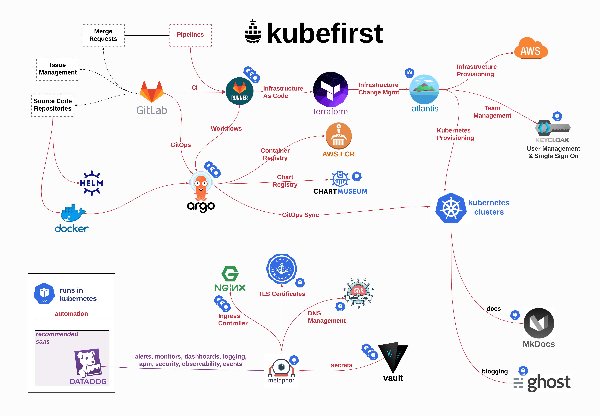
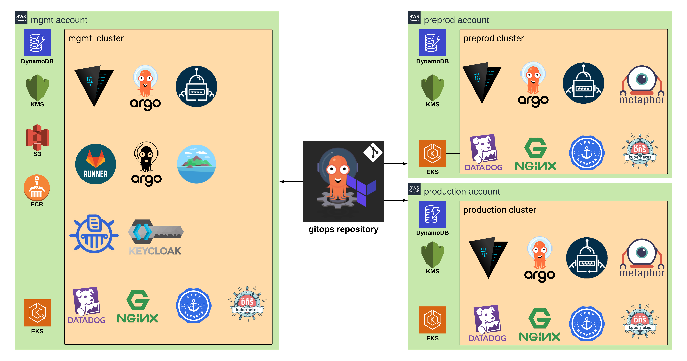

# Enterprise offering

### Thousand foot view

The kubefirst team has the ability to pro plan delivers 3 AWS accounts: `mgmt`, `preprod`, and `production`. Everything delivered in these 3 accounts has been sourced from the `gitops` repository which houses all of our Terraform IAC and Argo CD gitops configurations.

It includes Source Control, Single Sign On, Secrets Management, 
Automated Infrastructure as Code, Helm Package Management, GitOps Delivery, 
Managed Kubernetes, Container Registry, Automated SSL Certificates, Container Scanning, 
User Management, An Example Demo Application, Application Monitoring, Logging & Observability, 
and a Docs and Blogging platform for your internal or external communications.

### Kubefirst Clusters

Each kubernetes cluster provided by the pro plan are Amazon EKS managed clusters bootstrapped with the following technologies:

- argo-cd for gitops resource management
- vault for secrets management
- ingress-nginx to serve as the ingress controller and reverse proxy
- cert-manager to provide TLS certificates and to manage cert auto-renewal
- external-dns to automatically create DNS records in your hosted zones
- datadog-agent to monitor the cluster, surface logs, and provide container observability
- external-secrets to transform vault secrets to native kubernetes secrets

### The mgmt account

The `mgmt` account includes a Gitlab Server to privately host all of your source control repositories

It includes a `mgmt` kubefirst cluster with the 7 standard technologies listed above plus:

- gitlab-runner to run CI jobs and to integrate gitlab with argo-workflows
- argo-workflows for orchestrating ci in a kubernetes-native way
- atlantis to manage terraform changes, document terraform plans on the merge request, and manage state store locks

### The preprod account

The `preprod` account is your preview cluster and account. It includes a `preprod` kubefirst cluster with the 7 standard technologies listed above plus a development and staging namespace. Each of which has an example application named metaphor that delivers updates to each environment to demonstrate pre-release part of your delivery cycle.

### The production account

The `production` account includes a `production` kubefirst cluster with the 7 standard technologies listed above plus a production namespace. The metaphor example application delivers to `production` to demonstrate release part of your delivery cycle.

Your blog and docs sites will also run in this cluster.
